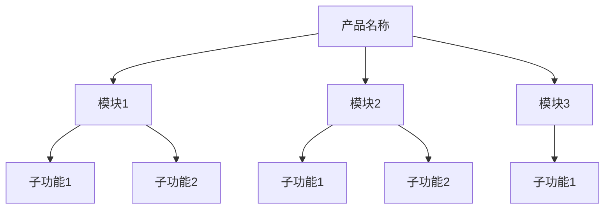

# 产品功能结构图

> **维护规则**：
> - 每次 PRD 移入正式区（prds/）后，AI 提议追加新功能节点，用户确认后写入
> - PRD §5「功能结构」只写本需求新增/调整的节点，完整产品结构见本文件
> - `/update-prd` 更新正式区 PRD 且引入新功能节点时同样触发更新提议
> - `/ingest-prd` 导入历史 PRD 进入正式区后同样触发更新提议

---

## 初始化说明

请在首次使用前填写以下内容。完成后删除本段说明。

**需要填写的内容：**
1. 产品的功能模块划分
2. 各模块的英文前缀（用于功能编号）
3. 功能结构树（Mermaid 图）
4. 初始功能清单

---

## 功能编号前缀映射表

> AI 为功能点生成编号时（格式：`[AREA]-[CATEGORY]-[SEQ]`），先查此表复用已有前缀；
> 新模块才推导英文缩写，并追加到本表。

| 业务模块名（中文） | 英文前缀（AREA） | 首次引入版本/PRD |
|---|---|---|
| （示例）用户管理 | USR | v1 基线 |
| （示例）订单管理 | ORD | v1 基线 |
| （请填写） | | |

---

## 产品功能结构树

> 使用 Mermaid 语法描述产品的功能结构



---

## 功能清单（v1 基线）

### 模块1（MOD1）

| 功能编号 | 功能名称 | 载体命令/文件 | 状态 |
|----------|----------|--------------|------|
| MOD1-F001 | 示例功能 | /示例命令 | ✅ 已实现 |
| （请填写） | | | |

### 模块2（MOD2）

| 功能编号 | 功能名称 | 载体命令/文件 | 状态 |
|----------|----------|--------------|------|
| （请填写） | | | |

---

## PRD 中引用方式

在 PRD §5「功能结构」章节，按以下格式引用：

```markdown
## 功能结构

> 完整产品结构参考：context/product-feature-map.md
> 以下仅列出本需求新增/调整的节点。

### 新增功能节点

- [模块名] → [子功能名]

### 调整功能节点

- [原节点] → [新节点]
```
