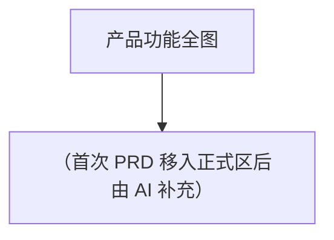

# 产品功能结构图

> **维护规则**：
> - 每次 PRD 移入正式区（prds/）后，AI 提议追加新功能节点，用户确认后写入
> - PRD §5「功能结构」只写本需求新增/调整的节点，完整产品结构见本文件
> - `/update-prd` 更新正式区 PRD 且引入新功能节点时同样触发更新提议
> - `/ingest-prd` 导入历史 PRD 进入正式区后同样触发更新提议

---

## 功能编号前缀映射表

> AI 为功能点生成编号时（格式：`[AREA]-[CATEGORY]-[SEQ]`），先查此表复用已有前缀；
> 新模块才推导英文缩写，并追加到本表。

| 业务模块名（中文） | 英文前缀（AREA） | 首次引入版本/PRD |
|---|---|---|
| （首次 PRD 移入正式区后由 AI 提炼并追加） | | |

---

## 产品功能结构树

> 随迭代逐步完善，每个 PRD 贡献其新增节点。

