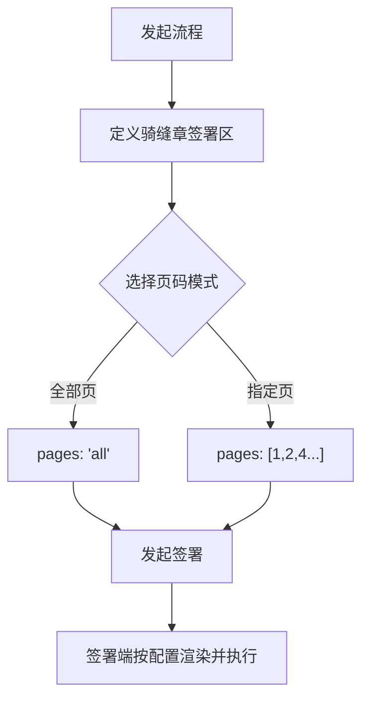

# 骑缝章签署区能力覆盖国际站

## 用户故事

**主故事**
> **As a** 国际站发起方，
> **I want to** 在发起签署时指定骑缝章签署区的页码范围及盖章样式，
> **so that** 确保参与方只在指定页面范围内加盖骑缝章，满足合规要求。

**补充故事**
> **As a** 签署参与方（国际站），
> **I want to** 在签署页看到骑缝章签署区并按发起方指令完成盖章，
> **so that** 无需理解底层页码逻辑，签署行为受系统约束保障合规。

---

## 功能概述

国内站已有骑缝章签署区能力，本次将该能力覆盖至国际站，并同步调整模板编辑页/指定位置页/填签一体页的骑缝签署区交互方案。

核心变更：
1. **L1 底座**：RPC 协议扩展，签署区 `pages` 字段支持多页码数组（含非连续页）
2. **发起侧**：支持"全部页"或"自定义页"模式，支持锁定或开放盖章样式
3. **签署侧**：国际站签署页适配骑缝章渲染逻辑；各类 TSP（P7/P1）支持骑缝章
4. **交互调整**（国内+国际）：模板编辑页/指定位置页取消独立"骑缝章控件"，改为展开收起的骑缝区域，拖入该区域的控件自动获得骑缝章属性

> **合规底线**：骑缝章加盖后文档每页完整性须可被验证；非连续页码场景下，未勾选页不得被错误包含在数字摘要计算中。

---

## 功能流程图

---

## 页面 & 交互说明

### 页面 A：模板编辑页 / 指定位置页 / 填签一体页（交互方案变更）

**页面用途**：发起方配置骑缝章签署区。

**核心交互变更**（国内站+国际站统一）：

- **无独立"骑缝章控件"**，改为页面上的**展开/收起骑缝区域**
- 默认收起；点击后展开，设计稿参考：Figma epaas-签署 node-id=3437-2571
- 仅允许拖入：签署区、图章区、签名区、骑缝签署区类型的控件（含基础控件和业务控件），其他类型禁止拖入，拖过时显示禁用图标

**控件落入骑缝区域后属性变化**：
- 签署区：去掉"显示签署日期"、"落章规则"；应用页面属性去掉"当前页"
- 图章区 / 签名区：去掉"落章尺寸规则"；应用页面属性去掉"当前页"

**拖拽规则**：
- 骑缝区展开时：控件落在骑缝区域内 → 归入骑缝区；落在非骑缝区域 → 归入非骑缝区；落在边界 → 默认归入骑缝区（UED 定边界）
- 骑缝区收起时：正常落入所有可放置区域
- 骑缝区与非骑缝区的控件不允许相互换位置

**国内站骑缝章实现方式**：取消独立的骑缝章业务控件，统一改为页面上的"展开骑缝章区域"按钮，点击展开后将签署区控件拖入该区域实现骑缝章能力。

---

### 页面 B：签署页（指定位置，PC & H5）— 国际站

**交互规则**：
- 展示骑缝章控件
- 点击控件后，印章范围依据发起侧指定位置过滤（图章或签名）

---

### 页面 C：签署页（自由签，PC & H5）— 国际站

**交互规则**：
- 展示"加盖骑缝章"入口；点击后展开骑缝章区域
- 可拖入图章控件或签名控件；点击控件后可选择印章
- 文档仅一页时：**不展示骑缝章入口**
- 自由签模式下**不支持换章**

---

## 业务规则

| 规则编号 | 规则描述 | 备注 |
|----------|----------|------|
| BR-01 | `pages` 字段底层不做连续性校验，作为物理加盖的唯一参考依据 | L1 底座逻辑 |
| BR-02 | BFF 层根据签署区类型过滤可用样式；国际站需支持图章控件与签名控件 | L2 适配 |
| BR-03 | 样式优先级：发起方指定样式 > 参与方默认样式 > 系统全局配置 | 渲染优先级 |
| BR-04 | 原文 TSP 不支持骑缝章；P7 与 P1 类 TSP 可支持骑缝章 | 国际站现有 TSP 均应支持 |
| BR-05 | 后端不变更，公有云/天印/OpenAPI 无需重新对接；国际站 OpenAPI 骑缝章新对接方式**本期不做** | 对接范围限制 |
| BR-06 | 国内站模板编辑页/指定位置页按新交互方案执行；填签页/签署页交互优化直接上，无需灰度 | 国内站上线策略 |

---

## 边界条件 & 异常处理

| 场景 | 处理方式 |
|------|----------|
| 指定页码超出文档实际总页数 | 前端拦截报错，阻止发起 |
| 文档只有一页 | 自由签模式不展示骑缝章入口 |
| 发起方已锁定样式 | 参与方签署时无法新增/更换骑缝章样式 |
| OpenAPI 感知页数能力 | 通过文件系统扫描感知页数，可实现后端拦截超限页码 |
| 国内站灰度期间旧版本用户 | 公有云按 OID 灰度（每周 25%，1 个月内完成）；天印无灰度 |

---

## 非功能需求

| 类型 | 要求 |
|------|------|
| 合规 | 骑缝章加盖后，文档每页完整性须可被验证；非连续页码场景下未勾选页不得被纳入数字摘要 |
| 兼容性 | 历史数据与新数据均按原骑缝签署区类型对接，后端无需改动 |
| 灰度 | 国内站模板编辑页/指定位置页按 OID 灰度，每周 25%，约 1 个月完成 |

---

## 验收标准

- [ ] **AC-1 指定页码范围**：发起页支持勾选"全部页"或"指定页"；输入非连续页码（如 1, 3, 5）时，系统准确记录并透传至 RPC `pages` 字段
- [ ] **AC-2 指定盖章样式**：发起方可选择该站点支持的骑缝章样式；选中后配置持久化至签署节点属性
- [ ] **AC-3 自由签样式可选**：发起方未锁定样式时，参与方进入签署页样式选择器可用；切换样式时预览区域实时渲染
- [ ] **AC-4 受控签署行为**：发起方已指定样式时，参与方无法新增骑缝章；签署后仅在指定 `pages` 范围内加盖，非目标页保持无章状态
- [ ] **AC-5 超限拦截**：指定页码超出文档实际总页数时，系统拦截报错

---

## 开放问题

| # | 问题 | 状态 |
|---|------|------|
| 1 | 国际站 OpenAPI 感知页数能力：若缺失，后端无法拦截超限页码 | ✅ 已确认：通过文件系统扫描感知页数，可后端拦截 |
| 2 | 国内站骑缝章业务控件的处理方式 | ✅ 已确认：取消业务控件，统一改为"展开骑缝章区域按钮 + 拖入签署区控件"方案 |

---

## 变更记录

> 详细变更历史见同目录 `CHANGELOG.md`。

| 版本 | 日期 | 变更摘要 |
|------|------|----------|
| 1.0 | 2026-04-06 | 初始录入，来源：迭代记录原始数据/20260305迭代需求 |
