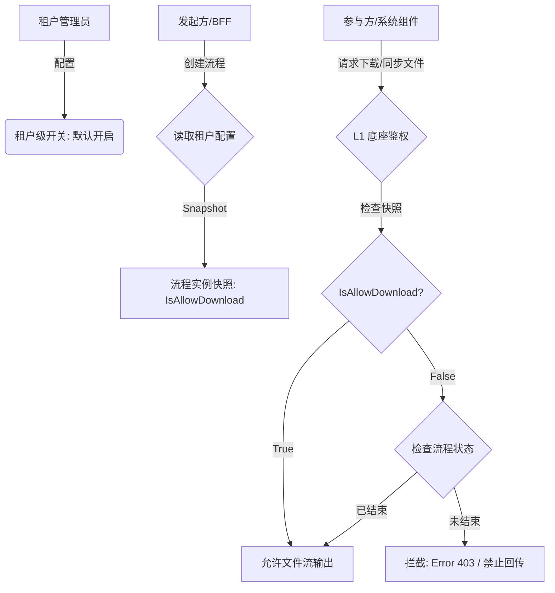

# 租户级流程中下载权限控制

## 用户故事

**主故事**
> **As a** 租户管理员（金融、军工等高安全需求场景），
> **I want to** 统一配置"流程进行中是否允许下载合同文件"，
> **so that** 在流程未结束前严格防止文件外泄，满足合规管控要求。

**补充故事**
> **As a** 签署参与方，
> **I want to** 在流程进行中根据发起方的设定看到或看不到下载按钮，
> **so that** 系统行为与安全策略一致，无法绕过权限下载文件。

---

## 功能概述

针对金融、军工等高安全需求租户，在 L1 底座层面增加"流程未结束禁止下载"管控开关。租户管理员在后台配置开关，流程创建时生成 `IsAllowDownload` 状态快照，L1 底座 `FileService` 在所有下载/文件同步请求处统一执行鉴权拦截。

覆盖范围：国内站、国际站。**两条产品线的行为设计和实现方案均不同，是有意的产品差异而非历史遗留**（见业务规则 BR-01/BR-02）。

> **合规底线**
> - 国内站：符合《电子签名法》数据完整性及安全性要求
> - 国际站：允许在线查看，禁止离线物理下载，不违反 eIDAS"审阅权（Right to Review）"
> - 本地化（天印）：符合《数据安全法》重要数据流动管控要求，禁止非法数据回传

---

## 功能流程图

---

## 页面 & 交互说明

### 页面 A：租户后台管理 — 下载权限配置

**页面用途**：管理员统一配置流程进行中的下载权限。

**页面元素**：
- 国内站：后台配置入口（见原型图）
- 国际站：偏好设置中新增下载权限开关

**交互规则**：
- 开关默认开启（允许下载）
- 国内站：开关切换**对已发起流程立即生效**
- 国际站：开关切换**仅对后续新发起流程生效**（快照逻辑）

---

### 页面 B：签署页 / 预览页

**交互规则**：
- 已配置"禁止下载"时，签署页和预览页**不展示下载按钮**

---

### 页面 C：列表页（含批量下载）

**交互规则**：
- 已配置"禁止下载"时，列表页**不展示下载按钮**（含批量下载入口）
- 后端权限过滤结果随接口返回，前端（国际站由前端承载展示逻辑）据此控制按钮显隐

---

## 业务规则

| 规则编号 | 规则描述 | 备注 |
|----------|----------|------|
| BR-01 | **国际站（快照方案）**：流程创建时生成 `IsAllowDownload` 快照，配置变更仅对后续新发起流程生效，进行中流程不受影响；实现上依赖流程实例快照字段 | 国际站产品线设计 |
| BR-02 | **国内站（实时方案）**：配置开关切换后对所有进行中流程立即生效；实现上不依赖快照，直接读取当前租户配置 | 国内站产品线设计，实现方案与国际站不同 |
| BR-03 | 禁止下载时，L1 底座不仅隐藏 UI 按钮，还需在跨租户通信时拦截实际文件流输出（防绕过） | 双层防护 |
| BR-04 | 流程结束后（已完成/已撤回等终态），无论配置如何，允许下载 | 仅限进行中拦截 |
| BR-05 | 参与方仅有预览权限时，无论下载开关状态，均不允许下载 | 权限叠加，预览权限优先 |
| BR-06 | 具体权限方案由权限团队决策实现（心瞻-严佳瑞、陵川-林相德） | 实现层依赖 |

---

## 边界条件 & 异常处理

| 场景 | 处理方式 |
|------|----------|
| 流程进行中，禁止下载 | 返回 Error 403，前端隐藏下载按钮 |
| 流程已结束 | 允许下载，不受禁止开关约束 |
| 参与方仅有预览权限 | 无论开关状态均不可下载 |
| 跨租户通信中的文件同步请求 | L1 底座同样执行鉴权拦截，防止通过系统内部通道绕过限制 |
| 国内站管理员在流程进行中修改开关 | 对该进行中流程**立即生效** |
| 国际站管理员在流程进行中修改开关 | 该进行中流程**保持原快照状态**，新流程按新配置执行 |

---

## 字段清单

> ⚠️ 待补充：`Process_Instance` 表新增字段 `IsAllowDownload` 的具体定义（类型、默认值、枚举值等）。由技术侧提供。

---

## 非功能需求

| 类型 | 要求 |
|------|------|
| 安全 | L1 底座统一鉴权，UI 隐藏按钮不作为唯一防线，后端需拦截实际文件流 |
| 合规 | 国际站需保证在线查看权不受影响（eIDAS 审阅权），仅限制离线下载 |
| 兼容性 | 本地化（天印）场景下符合《数据安全法》数据流动管控要求 |

---

## 验收标准

- [ ] **AC-1**：租户关闭下载开关后，新发起的合同在"签署中"状态下，页面不展示下载按钮，且实际无法下载（后端拦截）
- [ ] **AC-2**：参与方仅有预览权限时，无论开关状态，均不能下载
- [ ] **AC-3【国际站·快照方案】**：管理员在流程进行中关闭下载开关，该进行中流程保持原快照状态（仍禁止下载）；新发起流程按新配置生效
- [ ] **AC-4【国内站·实时方案】**：管理员切换下载开关后，所有正在进行中的流程立即同步新的下载权限状态，无需重新发起

---

## 开放问题

| # | 问题 | 状态 |
|---|------|------|
| 1 | 国内站"实时生效"与国际站"快照锁定"是否为有意的产品线差异 | ✅ 已确认：两条产品线有意差异，实现方案不同，不需要对齐 |
| 2 | 字段清单：`IsAllowDownload` 字段定义由技术侧提供 | 技术侧待补充 |

---

## 变更记录

> 详细变更历史见同目录 `CHANGELOG.md`。

| 版本 | 日期 | 变更摘要 |
|------|------|----------|
| 1.0 | 2026-04-06 | 初始录入，来源：迭代记录原始数据/20260305迭代需求 |
