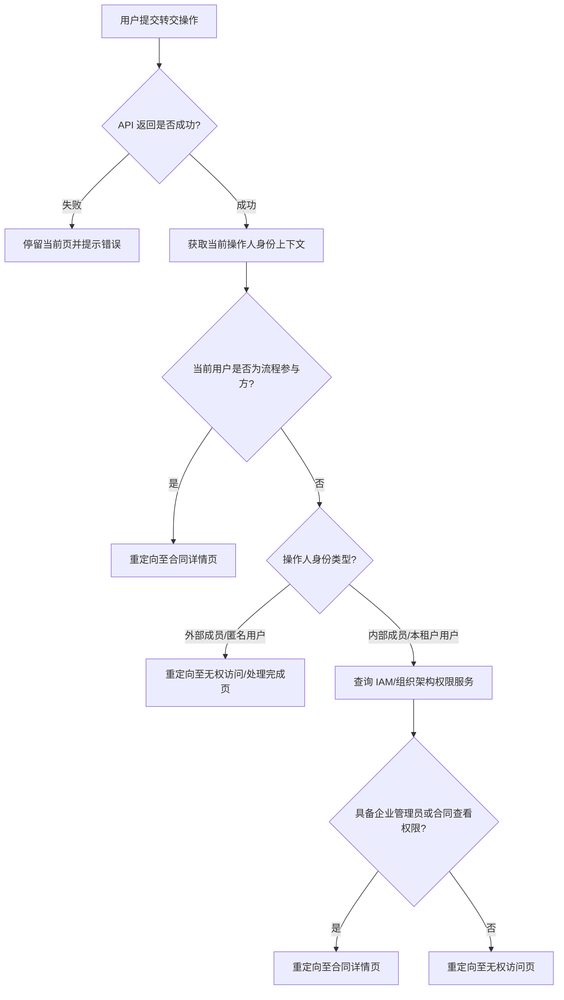

# 转交信封用户重定向逻辑补充

## 用户故事

**主故事**
> **As a** 签署参与方，
> **I want to** 在完成转交操作后被引导至合理的页面，
> **so that** 我知道转交已完成，且不会因权限不足停留在无效页面上。

**补充故事**
> **As a** 系统（BFF 层），
> **I want to** 在转交成功后根据当前操作人的身份上下文决定重定向目标，
> **so that** 不同角色的用户都能落到权限范围内的合法页面。

---

## 功能概述

> ⚠️ 待补充：原始文档未提供产品背景。以下为从流程图推断的功能描述，请确认或补充。

签署任务转交完成后，原签署人已离开任务节点，系统需根据其剩余身份上下文决定重定向目标。本功能在 **PaaS BFF 层**实现，分两层判定：
- **L1 通用逻辑**：判断操作人是否仍为流程参与方（发起方/抄送方/填写方/后续签署节点参与方）
- **L2/L3 差异化逻辑（方案A）**：非参与方时，进一步区分外部/匿名用户与内部用户，结合 IAM 权限决定最终落点

---

## 功能流程图

> 流程参与方定义：发起方（Creator）、抄送方（CC）、填写方（Filler）、后续签署节点参与方（Next Signers）

---

## 页面 & 交互说明

### 重定向目标页汇总

| 场景 | 重定向目标 | 说明 |
|------|-----------|------|
| 操作人仍为流程参与方 | 合同详情页 | 仍有查看权限 |
| 外部成员 / 匿名用户，转交后无其他角色 | 无权访问/处理完成页 | 访问契约终止 |
| 内部用户，具备管理员或合同查看权限 | 合同详情页 | 具备管理视角权限 |
| 内部用户，无管理或查看权限 | 无权访问页 | |
| 转交 API 调用失败 | 停留当前页 + 提示错误 | 不执行重定向 |

---

## 业务规则

| 规则编号 | 规则描述 | 备注 |
|----------|----------|------|
| BR-01 | 重定向判定在 PaaS BFF 层实现，不在前端处理 | 架构分层 |
| BR-02 | 仅在转交 API 返回成功后执行重定向判定；失败时停留当前页 | 防止误跳转 |
| BR-03 | 参与方身份判定优先于权限判定（L1 先于 L2/L3） | 判定顺序 |
| BR-04 | 外部成员/匿名用户转交后视为访问契约终止，不再查询 IAM | 方案A 设计 |
| BR-05 | 内部用户需实时查询 IAM/组织架构权限服务判定是否有管理员或合同查看权限 | L2/L3 逻辑 |

---

## 边界条件 & 异常处理

| 场景 | 处理方式 |
|------|----------|
| 转交 API 失败 | 停留当前页，展示错误提示，不执行重定向 |
| IAM 权限服务查询超时/失败 | ⚠️ 待补充：降级策略未在原文中定义 |
| 用户同时具备多个角色（如发起方+抄送方） | 只要命中"仍为参与方"即重定向合同详情页 |

---

## 非功能需求

| 类型 | 要求 |
|------|------|
| 性能 | ⚠️ 待补充：IAM 权限查询对转交响应时长的影响是否有要求 |
| 架构 | BFF 层实现，不耦合前端；方案A，预留后续方案B/C扩展空间 |

---

## 验收标准

- [ ] **AC-1**：转交成功后，操作人仍为流程参与方（任意角色）时，页面跳转至合同详情页
- [ ] **AC-2**：转交成功后，操作人为外部成员或匿名用户且无其他角色时，跳转至无权访问/处理完成页
- [ ] **AC-3**：转交成功后，操作人为内部用户且具备企业管理员或合同查看权限时，跳转至合同详情页
- [ ] **AC-4**：转交成功后，操作人为内部用户但无管理或查看权限时，跳转至无权访问页
- [ ] **AC-5**：转交 API 返回失败时，页面停留在当前页并展示错误提示，不发生跳转

---

## 开放问题

| # | 问题 | 状态 |
|---|------|------|
| 1 | 此功能是否仅覆盖国内站？国际站是否有相同的转交后重定向诉求？ | 待确认 |
| 2 | IAM 权限查询失败时的降级策略（跳转无权页还是合同详情页）？ | 待确认 |
| 3 | 原文提到"方案A"，是否存在方案B/C？当前是否已确定只执行方案A？ | 待确认 |

---

## 变更记录

> 详细变更历史见同目录 `CHANGELOG.md`。

| 版本 | 日期 | 变更摘要 |
|------|------|----------|
| 1.0 | 2026-04-06 | 初始录入，来源：迭代记录原始数据/20260305迭代需求；原文仅含 PlantUML 流程图，用户故事及业务规则均为推断，需确认 |
