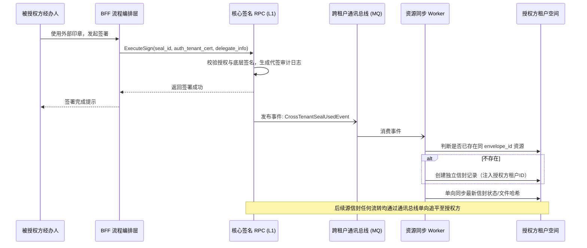
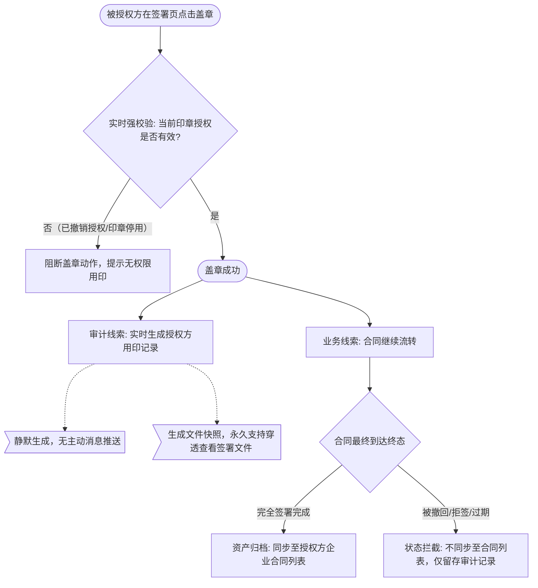

# 跨企业印章授权

> 📋 状态说明：本需求已规划至 **0416迭代**开发并上线，尚未进入已完成需求清单。上线后需补充需求ID并将状态更新为 `released`。

---

## 用户故事

**主故事（被授权方）**
> **As a** 被授权企业（如代理方/受托方）的经办人，
> **I want to** 在签署页直接使用授权企业的印章完成代签，
> **so that** 无需手动添加授权方为签署人，业务流程保持极简。

**补充故事（授权方）**
> **As a** 授权企业（印章所有方）的合规/印章管理员，
> **I want to** 在我的企业合同列表和用印记录中实时追踪印章使用情况，
> **so that** 在不参与被授权方业务流的前提下，仍能满足审计与归档合规要求。

---

## 功能概述

在企业间委托代办（如劳务代理 FESCO、集团子公司代章）等场景中，被授权企业（B）的经办人需使用授权企业（C）的印章完成签署。本功能通过"影子主体关联模式"实现：

- **C 不进入签署流程**，系统通过合同中引用的"印章ID"自动建立 C 与合同的关联
- **底层采用跨租户复制方案**（方案B）：落章成功后立即将信封数据物理复制至 C 的租户空间，彻底切断两企业的数据耦合
- **双线追踪**：用印记录（实时审计）与企业合同列表（仅完全签署完成后归档）

**适用范围**：仅国内站开放，国际站和天印默认关闭。

---

## 关键技术决策

### 决策1：数据存储方案 → 跨租户复制（方案B）

| 方案 | 机制 | 结论 |
|------|------|------|
| 方案A（数据引用） | 授权方只存指向被授权方文件的引用链接 | ❌ 否决：被授权方删除文件后授权方审计链断裂，合规漏洞 |
| **方案B（数据复制）** | **落章成功瞬间，将信封数据物理复制至授权方租户** | ✅ 采用：确保授权方数据主权，即使被授权方注销账号，审计证据永久存续 |

### 决策2：授权方角色模型 → 影子主体关联（方案3）

| 方案 | 机制 | 结论 |
|------|------|------|
| 方案1（签署方） | 将 C 作为自动签署节点加入流程 | ❌ 否决：用户体验差，逻辑冗余 |
| 方案2（授权签署方） | 新增特殊参与方角色 | ❌ 否决：需大改签署流程引擎 |
| **方案3（影子主体）** | **C 不进流程，通过印章ID自动建立资源关联** | ✅ 采用：流程无侵入，权责自洽，支持多授权方 |

### 决策3：合同列表展示策略 → 严格状态隔离

底层虽在落章瞬间复制数据，但**企业合同列表只展示"完全签署完成"的合同**，拒签/撤回/过期等中间态不进入列表（防止业务垃圾污染授权方列表视图）。用印记录模块承担实时审计职责。

---

## 功能流程图

### 主流程：代签与跨租户同步

### 盖章后双线追踪逻辑

---

## 页面 & 交互说明

### 页面 A：签署页 — 印章选择面板

**变更**：签署侧边栏印章区域分组展示：
- **我的印章**（本企业）
- **跨企业印章**（外部授权方）：外部印章 hover 显示悬浮提示，标注所属企业

**交互规则**：
- 发起方未指定印章，或指定印章要求中跨企业印章符合条件时，展示跨企业印章组
- 授权有效期内方可展示并允许使用；过期或已撤销则不展示

---

### 页面 B：签署完成后 — Timeline（PC & H5）

**变更**：Timeline 中展示代签结果，区分"签署操作方（经办人）"与"法律签署主体（授权企业）"

---

### 页面 C：授权方 — 企业合同列表

**变更**：合同列表中出现同 `envelope_id` 的信封，来源标注"授权印章加盖同步"。

**支持的管理能力**：合同备注、关联合同、续签类型打标、资源可见性设置、下载权限控制等（仅限授权方租户内操作，不回写至被授权方）

---

### 页面 D：授权方 — 用印记录

**变更**：授权方可通过用印记录模块查看每次跨企业用印记录，并可穿透"查看签署文件"（类似抄送方角色），支持下载对应合同

---

## 业务规则

| 规则编号 | 规则描述 | 备注 |
|----------|----------|------|
| BR-01 | 底层证书：代签时使用**授权方（C）**的 CA 证书，确保法律效力归属于 C | 合规底线 |
| BR-02 | 代签映射：底层日志不可篡改地记录"物理操作人（B经办人）"与"意愿主体（C）"的代签关系 | 审计要求 |
| BR-03 | 触发时机：落章成功时立即触发跨租户通讯事件，与信封整体是否结束无关 | 实时审计 |
| BR-04 | 合同列表归档条件：仅"完全签署完成"状态同步至授权方合同列表；撤回/拒签/过期均不同步 | 视图隔离 |
| BR-05 | 单向状态同步：被授权方信封状态变更通过 MQ 单向追平至授权方；授权方的本地操作（打标/归档）不逆向同步 | 数据隔离 |
| BR-06 | `envelope_id` 一致：授权方租户中的信封与源信封保持相同 ID，便于追溯 | 溯源 |
| BR-07 | 多端开关：国际站、天印通过 `ENABLE_CROSS_TENANT_SEAL` 全局关闭，BFF 拦截所有越权请求 | L2 配置 |
| BR-08 | PBAC 策略：`Allow Subject(C_Admin) → Action(View/Download) → Resource(Contract_X)` 条件：合同中含C的印章ID且C的授权状态为Active | 权限模型 |

---

## 边界条件 & 异常处理

| 场景 | 处理方式 |
|------|----------|
| 盖章时授权已撤销/印章停用 | BFF 实时强校验，阻断盖章动作，返回无权限提示 |
| 被授权方后续注销账号/删除合同 | 授权方的物理复制数据不受影响，审计证据永久存续 |
| 授权方对同步信封进行本地操作（打标/移动） | 仅在授权方租户生效，绝对不影响被授权方源信封 |
| 合同被撤回/拒签/过期 | 不进入授权方合同列表，仅在用印记录中留存审计证据 |
| 国际站/天印环境下调用 | BFF 拦截，前端不渲染外部印章组件 |
| 一份合同中包含多个授权方印章（C1、C2） | 各授权方权限自动隔离，分别同步至各自租户 |

---

## 非功能需求

| 类型 | 要求 |
|------|------|
| 合规 | 底层签名证书必须归属授权方；代签关系写入不可篡改审计日志 |
| 数据隔离 | 多租户物理隔离；授权方本地修改不得逆向污染被授权方数据 |
| 可靠性 | MQ 事件驱动的异步同步，需保证最终一致性；状态追平延迟在合理 MQ 消费延迟范围内 |
| 扩展性 | 影子主体模型支持未来集团统筹签署、第三方代办等复杂商业场景 |

---

## 验收标准

- [ ] **AC-1 印章 UI 区分**：签署页清晰区分内外印章；过期/未授权的外部印章在 BFF 与 RPC 层均被拦截（403）
- [ ] **AC-2 签名法律效力**：使用授权印章签署后，PDF 签名证书 Subject 为**授权方企业**；存证日志明确记录代签人员关系
- [ ] **AC-3 用印记录实时**：落章成功后，授权方用印记录立即生成，可穿透查看文件快照
- [ ] **AC-4 合同列表归档**：合同完全签署完成后，授权方合同列表出现该信封，`envelope_id` 与源信封完全一致
- [ ] **AC-5 单向状态追平**：源信封后续状态变更，授权方列表中状态在合理延迟内同步更新
- [ ] **AC-6 本地操作隔离**：授权方在本地打标签/移动文件夹，绝不影响被授权方源信封数据
- [ ] **AC-7 架构隔离**：国际站/天印环境下，前端无外部印章组件，API 调用被拦截

---

## 开放问题

| # | 问题 | 状态 |
|---|------|------|
| 1 | 已规划至 0416 迭代上线，上线后补充需求ID并更新状态为 released | 📋 已确认排期 0416 |
| 2 | 被授权方（B）经办人是否需要显式感知"我正在使用外部授权印章"？还是对 B 完全透明？ | 待确认 |

---

## 变更记录

> 详细变更历史见同目录 `CHANGELOG.md`。

| 版本 | 日期 | 变更摘要 |
|------|------|----------|
| 1.0 | 2026-04-06 | 初始录入，合并3个源文件：主PRD + 数据隔离技术选型决策 + 权限与租户复制决策方案 |
