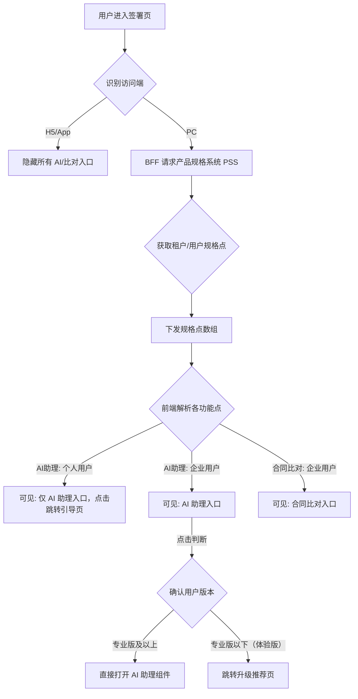

# 接入产品规格，支持在签署页展示AI助理和合同比对入口

## 用户故事

**主故事**
> **As a** 企业用户（专业版及以上），
> **I want to** 在签署页直接看到 AI 助理和合同比对功能入口，
> **so that** 无需跳转即可使用增值能力，提升签署决策效率。

**补充故事**
> **As a** 体验版企业用户，
> **I want to** 在签署页看到 AI 助理入口并被引导升级，
> **so that** 了解增值服务价值并做出升级决策。

---

## 功能概述

通过**产品规格系统（PSS）**实现签署页插件能力的动态发现与差异化分流。BFF 调用 PSS 获取当前租户/用户的功能矩阵（Capabilities），下发至前端控制入口显隐及交互行为。

核心差异点：
- **终端过滤**：PC 端展示，H5/App 完全隐藏
- **用户版本区分**：体验版点击跳转升级引导页，专业版及以上直接使用
- **功能 Key**：合同比对 `ai_tools_comparison`；AI 助理 `合同Agent功能key`（待确认）

---

## 功能流程图

---

## 页面 & 交互说明

### 页面 A：签署页 — AI/比对功能入口区域

**多端差异汇总**：

| 站点/终端 | 用户身份 | 功能入口 | 交互表现 |
|-----------|----------|----------|----------|
| 国内站-PC | 个人（含VIP） | AI 助理 | 点击跳转引导页 |
| 国内站-PC | 企业体验版 | AI + 比对 | AI 助理点击跳转引导页；合同比对直接使用 |
| 国内站-PC | 企业专业版及以上 | AI + 比对 | 直接使用 |
| 国际站-PC | 企业用户 | AI 助理 | 依据国际站要求控制 |
| 所有站点-H5 | 所有用户 | — | **完全隐藏** |

---

## 业务规则

| 规则编号 | 规则描述 | 备注 |
|----------|----------|------|
| BR-01 | 功能入口显隐由 PSS 下发的规格点数组控制，前端不硬编码版本判断 | L2 配置化驱动 |
| BR-02 | H5/App 端不加载 AI 及合同比对相关组件 | 终端过滤 |
| BR-03 | 国内站 AI 服务路由至国产大模型；国际站路由至符合 eIDAS 的合规模型 | 数据合规 |
| BR-04 | 前端展示权限与后端 RPC 接口校验权限必须在 PSS 中配置一致，防止 URL 越权调用 | 安全一致性 |
| BR-05 | 合同比对功能 Key：`ai_tools_comparison`；AI 助理功能 Key 待确认 | 配置标识 |

---

## 边界条件 & 异常处理

| 场景 | 处理方式 |
|------|----------|
| PSS 接口超时/不可用 | ⚠️ 待补充：降级策略（隐藏所有入口还是展示默认入口？） |
| 体验版用户点击 AI 助理 | 跳转升级引导页，不触发后端 AI 服务调用 |
| 手动构造 AI 助理 RPC 请求（越权）| 本次 AC-4 明确标注"不涉及"，后端拦截能力待后续补充 |

---

## 非功能需求

| 类型 | 要求 |
|------|------|
| 安全 | PSS 配置须保证前后端权限一致，防 URL 越权 |
| 合规 | AI 服务按地区路由，不混用 |
| 架构 | L2 配置化驱动，底座无污染 |

---

## 验收标准

- [ ] **AC-1 终端隔离**：移动端 H5 打开签署链接，页面不加载 AI 及合同比对按钮
- [ ] **AC-2 个人权限**：个人用户（含VIP）登录签署页，仅可见 AI 助理，无合同比对入口
- [ ] **AC-3 企业转化**：体验版企业用户点击 AI 助理，按 PSS 配置跳转至指定升级引导页
- [ ] **AC-4 后端拦截**：（本次不涉及，后续补充）手动构造体验版 AI 助理 RPC 请求应被 BFF 拦截

---

## 开放问题

| # | 问题 | 状态 |
|---|------|------|
| 1 | AI 助理（合同Agent）功能 Key 是什么？原文未明确 | 待确认 |
| 2 | PSS 接口不可用时的降级策略：隐藏所有入口还是展示默认配置？ | 待确认 |

---

## 变更记录

> 详细变更历史见同目录 `CHANGELOG.md`。

| 版本 | 日期 | 变更摘要 |
|------|------|----------|
| 1.0 | 2026-04-06 | 初始录入，来源：迭代记录原始数据/20260319迭代需求 |
