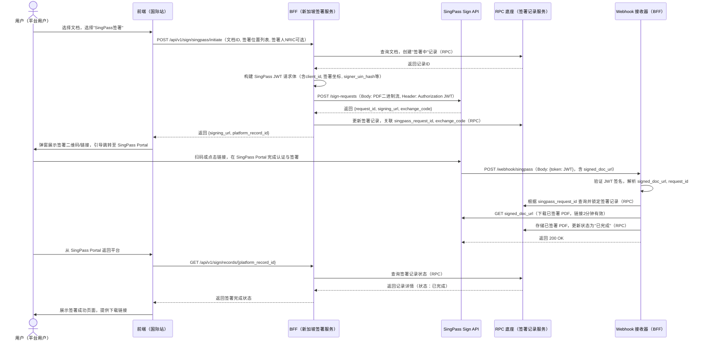

# 支持 SingPass 原文签署 TSP 能力

> 📋 状态说明：对应需求 **15863**（P1，国际站），当前标注为"方案预研"阶段，尚未进入实现迭代，不在已完成需求清单中。待排期后更新状态为 `released`。

---

## 用户故事

**主故事**
> **As a** 国际站新加坡区域用户，
> **I want to** 在签署页使用 SingPass 完成具有法律效力的电子签名，
> **so that** 满足当地合规要求，无需使用其他签署方式即可完成本地业务闭环。

---

## 功能概述

为国际站新加坡区域集成新加坡政府官方数字身份与签署服务 **Sign with Singpass**（RP 模式，Sign API V3）。SingPass 产生的签名符合新加坡《电子交易法》对**安全电子签名（SES）**的定义，具有法律效力。

实现路径：**BFF 层逻辑编排**。SingPass 特有的签署状态机、Webhook 回调处理等封装在国际站 BFF，RPC 底座仅提供签署记录的数据模型与存储服务。区域特性通过配置项和 BFF 路由实现，严禁在 RPC 底座硬编码地区判断。

---

## 功能流程图

---

## 页面 & 交互说明

### 页面 A：签署页 — SingPass 签署入口

**适用范围**：仅国际站新加坡区域用户可见。

**交互规则**：
- 用户选择文档后可选择"SingPass签署"作为签署方式
- 发起后弹窗展示签署二维码/链接，引导跳转至 SingPass Portal
- 签署完成后展示成功页面并提供下载链接
- **按钮样式**：需集成 SingPass 官方按钮样式（红色/白色），遵循其 UX 指南

---

## 业务规则

| 规则编号 | 规则描述 | 备注 |
|----------|----------|------|
| BR-01 | SingPass 仅在国际站新加坡区域启用，其他地区/站点不可见 | 区域隔离 |
| BR-02 | 签署位置数量上限：最多 20 个签署坐标 | SingPass API 限制 |
| BR-03 | 签署位置坐标格式：BFF 将平台坐标转换为 SingPass 要求的 (x, y, page) 相对坐标格式（0-1之间） | L2 BFF 处理 |
| BR-04 | 指定签署人时，NRIC Hash 必须正确计算（SHA256，大写）；SingPass 强制校验 | 身份指定 |
| BR-05 | Webhook 处理：收到通知后必须立即下载文档（链接2分钟有效），处理需保证幂等性 | 可靠性 |
| BR-06 | `exchange_code`、平台私钥等敏感信息必须加密存储于平台密钥管理服务 | 安全合规 |
| BR-07 | 所有 SingPass 特有逻辑必须封装在 BFF 层，严禁 RPC 底座出现 `if region == "singapore"` 硬编码 | 架构约束 |
| BR-08 | 取消签署：仅在状态为"待签"时允许调用取消接口，操作前需 RPC 锁定记录防并发冲突 | 状态机控制 |

---

## 接口参数说明

| 接口 | 关键参数 | 约束 |
|------|----------|------|
| `POST /api/v1/sign/singpass/initiate` | `document_id`、`sign_locations`（数组, ≤20）、`signer_nric`（可选） | NRIC 需符合新加坡格式；`signing_url` 有效期30分钟 |
| `POST /webhook/singpass` | `token`（JWT，含 `signed_doc_url`、`request_id`、`signer_info`） | 必须验证 JWT 签名（使用 SingPass 公钥） |
| `GET /api/v1/sign/records/{record_id}` | `record_id` | 状态映射：待签/已完成/已取消 |
| `POST /api/v1/sign/singpass/{record_id}/cancel` | `record_id` | 仅"待签"状态可调用 |

**配置项**：`singpass.enabled`（布尔）、`singpass.client_id`、`singpass.jwks_url`、`singpass.api_base_url`——按区域维度在平台配置中心管理。

---

## 边界条件 & 异常处理

| 场景 | 处理方式 |
|------|----------|
| Webhook 未及时触发 | 前端可通过查询接口主动轮询签署状态 |
| signed_doc_url 已过期（2分钟） | 需记录日志并配置重试策略 |
| SingPass API 返回错误码 | 转换为平台统一错误码和用户提示（如 `UNAUTHORIZED`、`DOCUMENT_ALREADY_SIGNED`） |
| 非新加坡区域用户访问 | BFF 按区域配置拦截，无 SingPass 入口 |

---

## 非功能需求

| 类型 | 要求 |
|------|------|
| 合规 | 符合新加坡《电子交易法》SES 定义；遵循 PDPA；满足 eIDAS AdES 身份认证要求 |
| 安全 | 平台与 SingPass API 通信全程 HTTPS；敏感信息加密存储 |
| 数据隔离 | 新加坡签署记录与文档完全隔离存储于国际站数据库 |
| 兼容性 | BFF 对前端接口签名尽量与平台现有签署接口一致，降低集成成本 |

---

## 验收标准

- [ ] **AC-1 发起签署**：国际站新加坡用户选择文档和签署位置后，可选择"SingPass签署"，成功生成签署链接与二维码，后台 SignRecord 状态为"待签"
- [ ] **AC-2 指定签署人**：指定有效 NRIC 后，仅该用户扫码可进入签署页，其他用户看到"非指定签署人"错误页
- [ ] **AC-3 多位置签署**：定义5个签署位置，SingPass Portal 要求依次确认5处，最终 PDF 在对应位置出现有效签名块
- [ ] **AC-4 Webhook 接收**：用户签署完成后，平台 Webhook 在10秒内收到通知，成功下载签署 PDF，SignRecord 状态更新为"已完成"
- [ ] **AC-5 主动查询**：Webhook 未触发时，前端查询接口能正确返回当前状态及下载链接（已完成时）
- [ ] **AC-6 取消签署**：对"待签"状态流程发起取消，SingPass 链接失效，SignRecord 更新为"已取消"
- [ ] **AC-7 多端隔离**：国内站、国际站非新加坡用户无 SingPass 签署选项；数据与其他区域完全隔离存储

---

## 开放问题

| # | 问题 | 状态 |
|---|------|------|
| 1 | 需求 15863 当前为"方案预研"状态，尚未分配实现迭代，待排期后同步更新PRD状态 | 📋 已确认为预研阶段 |
| 2 | Webhook 失败后的重试策略：重试次数、间隔、告警机制？ | 待确认 |

---

## 变更记录

> 详细变更历史见同目录 `CHANGELOG.md`。

| 版本 | 日期 | 变更摘要 |
|------|------|----------|
| 1.0 | 2026-04-06 | 初始录入，来源：迭代记录原始数据/20260319迭代需求 |
