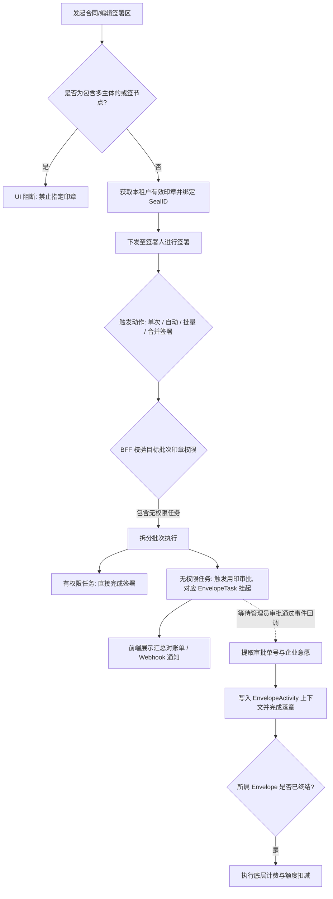

# 发起时可指定印章ID发起

> 📋 状态说明：本需求属于 **0402迭代**，尚未找到匹配的需求ID，上线后需补充需求ID并将状态更新为 `released`。

---

## 用户故事

**主故事（发起方）**
> **As a** 企业合同发起方（合规/印章管理员），
> **I want to** 在设置签署区时为特定签署方预指定唯一印章，
> **so that** 防止签署人在多印章场景下误用印章，实现对核心印章资产的强管控。

**补充故事（签署方 — 无权限场景）**
> **As a** 需要对指定印章盖章但暂无权限的经办人，
> **I want to** 在签署时自动触发用印审批而非直接被阻断，
> **so that** 业务流程可以继续推进，不因权限问题中断合同签署。

---

## 功能概述

在 PaaS 引擎（一底多端）架构下，本功能允许发起方在签署区配置阶段为特定签署方预绑定 `seal_id`，解决复杂组织架构下的跨租户印章误用风险。

核心场景覆盖：
- **常规签署**：发起时预绑定印章，签署侧只展示指定印章
- **或签节点防腐**：包含多主体的或签节点禁止指定印章，防止权责混淆
- **自动/批量/合并签署降级**：遇到无权限时采用"尽力而为"策略——有权限的直接完成，无权限的自动触发用印审批并挂起任务，不阻断全局流程

**架构层级**：L1 通用底座级变更（涉及 `EnvelopeTask` 状态机挂起/唤醒、`EnvelopeActivity` 上下文双录、发起端校验规则扩展）

**适用范围**：国内站全量支持；国际站视底层组件而定（TBD）；天印暂不接入。

**前置依赖**：签署区指定跨企业印章能力（F-005）需先上线，方可在签署区级别支持跨企业印章指定。

---

## 关键技术决策

### 决策1：降级策略 → 尽力而为（Best Effort）

无权限时不阻断全局流程。BFF 拆分批次：有权限的直接完成签署，无权限的自动触发用印审批并挂起对应 `EnvelopeTask`，前端展示分类汇总对账单。

### 决策2：计费解耦 → 严格挂载终态

指定印章挂起的任务不进行前置扣费。合同份数的扣费挂载于整个 `Envelope` 状态机变更为"已完成"的瞬间，规避并发退费风险。

### 决策3：意愿代持 → 企业主体双录

因合并签署挂起并由后续审批唤醒落章的任务，`EnvelopeActivity.context` 双录：
- **物理操作人**：实际经办人身份（原始触发动作）
- **意愿主体**：审批通过时的企业安全上下文（最终数字证书归属）

---

## 功能流程图

---

## 页面 & 交互说明

### 页面 A：发起配置页 — 签署区印章指定

**功能范围**：
- 通过页面可为每个签署方指定是否绑定特定印章ID
- 签署区级别：每个签署区可独立指定不同印章

**指定条件约束**：
- 仅发起方租户本企业印章（不包含分子企业印章、其他企业授权印章）
- 仅生效状态印章（停用/注销的不可指定）
- 仅企业章（经办人印章、法定代表人章不可指定）

**多端支持**：PC 和 H5 均需适配指定印章的交互

---

### 页面 B：签署页 — 权限引导与锁定提示

- **无权限时**：弹窗提示并提供"提交用印审批"独立入口
- **或签锁定中**：其他参与人"提交签署"按钮置灰，提示任务已被锁定

---

### 页面 C：合并/批量签署 — 混合批次汇总对账单

完成合并签署后展示分类汇总，如：
> "成功盖章 X 份，已自动为您提交用印审批 Y 份"

---

## 业务规则

| 规则编号 | 规则描述 | 备注 |
|----------|----------|------|
| BR-01 | 印章可见性：仅展示 `OWNED` 且 `ENABLED` 状态的印章；停用/注销印章不出现在选择列表 | 资产安全 |
| BR-02 | 跨主体或签禁止指定印章：包含多个企业主体的或签节点，发起时即禁用印章指定入口 | 防腐边界 |
| BR-03 | 已指定印章的签署区，禁止通过任何途径（加签/转交）添加 `participantSubject` 非本企业的参与者 | 防腐边界 |
| BR-04 | 合并签署采用"尽力而为"策略：BFF 拆分批次，有权限的直接完成，无权限的自动触发用印审批并挂起 `EnvelopeTask` | L2 编排 |
| BR-05 | 挂起的 `EnvelopeTask` 不触发前置计费；计费挂载于整个 `Envelope` 达到终态（完全签署完成）时 | 计费解耦 |
| BR-06 | 审批唤醒落章：审批通过后自动唤醒任务，不要求经办人重新认证意愿；`EnvelopeActivity.context` 双录操作人与企业意愿上下文 | 合规审计 |
| BR-07 | 实时状态强校验：提交签署瞬间对指定印章状态做实时强校验；若印章在此瞬间已被注销，返回校验失败，阻断落章 | 安全底线 |
| BR-08 | 自动签署失败处理：指定印章已删除时，接口同步返回失败，且配置的 Webhook 收到 1 次重试后的最终失败通知 | 可靠性 |
| BR-09 | 空资产拦截：当前租户下无任何有效印章时，点击"指定印章"功能无法选择，提示无可用印章 | 用户体验 |

---

## 边界条件 & 异常处理

| 场景 | 处理方式 |
|------|----------|
| 或签节点包含多主体时尝试指定印章 | UI 禁用指定入口，发起端返回校验失败 |
| 已指定印章的签署区尝试加签外部企业参与者 | BFF/RPC 强阻断，返回错误提示，无法完成人员添加 |
| 合并签署批次中部分有权限、部分无权限 | BFF 拆分执行：有权限直接完成，无权限触发审批挂起，前端汇总展示结果 |
| 或签节点某参与人正处于审批流程中 | 其他参与人"提交签署"置灰；接口强提交被明确报错拦截 |
| 指定印章在签署提交瞬间被注销 | 提交瞬间实时强校验，返回校验失败，不允许完成数字签名 |
| 自动签署时指定印章已删除 | 接口同步返回失败 + Webhook 1次重试失败通知 |
| 国际站跨企业转交遇指定印章 | 【TBD】需确认是否校验拦截非本租户转交行为 |
| 天印环境 | 暂不接入，前端不渲染相关入口 |

---

## 非功能需求

| 类型 | 要求 |
|------|------|
| 合规 | 合并签署审批落章的合同，审计日志明确记载经办人与企业意愿双录；意愿证据链符合《电子签名法》要求 |
| 数据安全 | 严格多租户数据隔离，禁止通过动态加签将企业内部印章暴露给外部主体 |
| 可靠性 | 审批回调唤醒落章需保证幂等性；挂起任务不因超时或中间态丢失 |
| 扩展性 | L1 底座的 `EnvelopeTask` 状态机挂起/唤醒机制，可复用于其他需要异步审批的场景 |

---

## 验收标准

- [ ] **AC-1 发起端跨主体防腐**：若设置了包含 A 企业和 B 企业的或签节点，点击该签署区，右侧面板无法指定具体印章
- [ ] **AC-2 跨企业加签防腐阻断**：针对已指定印章的签署区，输入外部企业手机号/邮箱尝试添加参与者时，系统强阻断报错，无法完成人员添加
- [ ] **AC-3 合并签署无权限拆单汇总**：通过短链接进入合并签署，批次包含 2 份有权限文件 + 1 份指定印章无权限文件；点击合并签署后前端准确弹窗提示"2份成功，1份触发审批"，底层精准生成 1 个挂起任务 + 1 条后台审批流
- [ ] **AC-4 或签防并发独占锁定**：或签节点中张三发起用印审批期间，李四进入签署页看到"提交签署"置灰且有明确锁定提示；李四通过接口强提交被系统明确报错拦截
- [ ] **AC-5 计费状态机解耦校验**：合并签署中无权限被挂起的任务触发期间，企业计费账户（合同份数）余额不发生变动；待审批通过且信封流转至终态后，方才执行扣除 1 份合同额度
- [ ] **AC-6 意愿双录审计合规闭环**：查阅由"合并签署静默触发审批"并最终由"管理员审批完成落章"的合同审计日志，明确记载发起操作人为实际经办人，但最终意愿数字证书归属为企业主体及审批安全上下文

---

## 开放问题

| # | 问题 | 状态 |
|---|------|------|
| 1 | 本需求对应的需求ID（Req ID）尚未在已完成需求清单中找到匹配项，上线后需补充 | 待确认 |
| 2 | 国际站跨企业转交遇指定印章时：是否需要校验拦截非本租户转交？具体拦截逻辑如何 | 待确认 |
| 3 | 签署区级别指定跨企业印章（F-005）的前置依赖：是否在 F-005 上线前完全禁用此入口，或只禁用跨企业部分？ | 待确认 |

---

## 变更记录

> 详细变更历史见同目录 `CHANGELOG.md`。

| 版本 | 日期 | 变更摘要 |
|------|------|----------|
| 1.0 | 2026-04-06 | 初始录入，来源：迭代记录原始数据/20260402迭代需求文档/发起时可指定印章ID发起.md |
