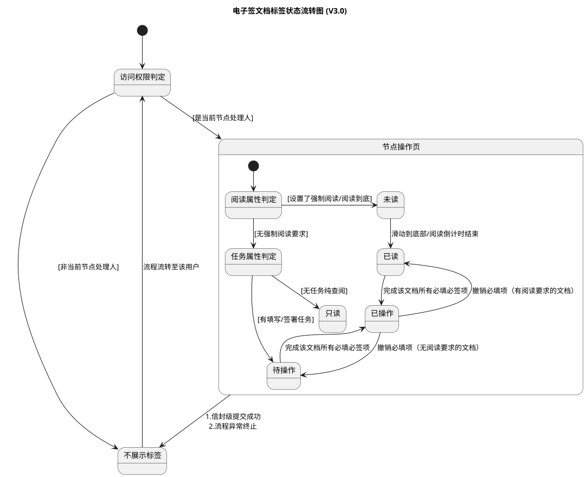

# 签署页文档标签状态规范

> 📌 版本与需求关系：**15013**（文档状态内容提示说明优化）对应 **V2 版本**，已上线。本文档（V3.0）为 **0416 迭代**中某需求触发的增量改动（新增未读/已读标签、强制阅读优先级逻辑），需求ID待 0416 迭代完成后补充。

> 📌 版本说明：本文档为 V3.0（最新版）。V1→V2 主要演进点：V2 将标签从全生命周期展示收缩为操作导向；V3 在 V2 基础上新增强制阅读优先级（未读/已读标签），并引入"指引解耦"原则（标签只反映状态，跨文档操作引导交由步骤条 F-009 负责）。

---

## 用户故事

> **As a** 签署方（当前节点处理人），
> **I want to** 在多文档信封的文档导航栏中，通过清晰的标签了解每份文档的当前操作状态，
> **so that** 我能快速判断哪些文档需要处理、哪些仅需查看，减少操作遗漏和困惑。

---

## 功能概述

本文档定义填签一体页（及文档列表页）中"文档级操作状态标签"的完整规范，覆盖：
- 标签的定义与触发条件
- 标签的展示矩阵（谁在什么情况下看到什么）
- 状态流转与撤销回退规则
- 多端（H5 / App / PC）展示一致性要求
- 与全局步骤条（F-009）的职责边界

**架构层级**：L3 前端签署插件层

**设计原则**：
1. **极简降噪**：非当前处理人、纯查阅方、已处理完成、流程终结 → 一律不展示标签
2. **合规优先**：强制阅读具有最高优先级，视觉上优先覆盖常规操作标签
3. **指引解耦**：标签只客观反映文档状态，跨文档操作引导由全局步骤条（F-009）负责

---

## 标签定义

系统对当前节点处理人动态展示以下五种标签（优先级从高到低）：

| 标签名称 | 优先级 | 含义 | 适用场景 |
|----------|--------|------|----------|
| **未读** | 最高 | 必须阅读且未完成 | 发起方对该文档设置了"强制阅读"或"阅读到底"，且用户尚未完成阅读。**仅国内站支持**，国际站不展示此标签 |
| **已读** | 高 | 强制阅读要求已满足 | 用户已滑动到底部或阅读倒计时结束；此时不展示"待操作"，后续签署由步骤条引导。**仅国内站支持** |
| **待操作** | 中 | 需处理且未完成 | 该文档无强制阅读要求，且包含用户尚未完成的签署、填写或审批任务 |
| **已操作** | 终态 | 当前文件已达到提交条件 | 该文档所有需要当前用户**必须操作**的内容均已完成（无论是否有阅读要求）。0205迭代新增，已全量上线 |
| **只读** | 终态 | 无操作权限，仅可查看 | 该文档无强制阅读要求，且仅需用户查阅，无任何签署/填写任务 |

**不展示标签**的场景：
- 用户为非当前节点（如顺序签未轮到、抄送人、管理员）
- 当前信封级别所有任务已提交（落袋为安）
- 信封主状态进入完结态（已过期/已拒签/已撤回）
- 单文档信封（仅一份文档时不展示标签）
- 纯填写场景且所有控件均为非必填

---

## 标签展示矩阵（当前处理人视角）

| 文档配置 | 阅读完成情况 | 任务完成情况 | 最终展示标签 |
|----------|-------------|-------------|-------------|
| 仅查阅 + 强制阅读 | 未读完 | — | **未读** |
| 仅查阅 + 强制阅读 | 已读完 | — | **已读**（终态）|
| 仅查阅（无阅读要求） | — | — | **只读**（终态）|
| 有任务 + 强制阅读 | 未读完 | 未签/未填 | **未读** |
| 有任务 + 强制阅读 | 已读完 | 未签/未填 | **已读**（任务引导交由步骤条）|
| 有任务（无阅读要求） | — | 未签/未填 | **待操作** |
| 有任务（任意阅读要求） | 已读完/无要求 | 已签/已填完 | **已操作**（文件级终态）|

---

## 状态流转规则

### 激活与全局隐藏

- **激活**：流程流转至某用户节点时，系统依据上述矩阵自动激活对应标签
- **或签场景**：任一候选人完成操作后，其余候选人标签立即转为"不展示"
- **落袋为安**：用户点击信封级【提交】成功后，该用户视角下所有文档标签**立即消失**
- **异常终结**：信封主状态变为已过期/已拒签/已撤回时，所有标签**立即清除**

### 文档内状态递进

- **阅读递进**：未读 → 滑动到底部/倒计时结束 → 已读
- **操作递进**：在【已读】或【待操作】状态下，完成所有必填/必签项 → 实时转为【已操作】

### 撤销回退

- 清除已签名控件或清空必填项，导致不满足提交条件：
  - 原带有强制阅读要求的文档：已操作 → **已读**
  - 原无强制阅读要求的文档：已操作 → **待操作**

---

## 状态流转图（V3.0）

---

## 多端展示一致性

本方案统一 H5、App、PC 端的展示逻辑，消除历史差异：

| 入口 | 标签行为 |
|------|----------|
| PC 签署页（左侧文档导航） | 按矩阵规则展示，混合权限场景下清晰区分【待操作】与【只读】 |
| H5 签署页（文档导航栏） | 与 PC 逻辑完全一致 |
| App / H5 列表页 | 仅在"待办任务"分类下展示，已完成任务列表不显示文档级标签 |
| 提交后再次进入信封 | 所有标签消失，保持纯净预览态 |

---

## 混合权限场景（同一信封含只读+待操作文档）

1. 用户打开信封，PC 左侧/H5 文档导航栏清晰标注哪些是【待操作】、哪些是【只读】
2. 用户完成所有【待操作】文档（变为【已操作】）后，点击提交
3. 提交成功后，所有文档标签（包括只读标签）全部移除

---

## 与全局步骤条（F-009）的职责边界

| 职责 | 文档标签（本文档）| 全局步骤条（F-009）|
|------|-----------------|------------------|
| 反映单文档状态 | ✅ | ❌ |
| 跨文档操作引导（"下一个"） | ❌ | ✅ |
| X 计数（待操作总数） | ❌ | ✅ |
| 强制阅读状态提示 | ✅（未读/已读标签） | ❌ |

---

## 验收标准

- [ ] **AC-1 标签优先级**：同一文档同时满足强制阅读未完成 + 有签署任务时，展示**未读**而非**待操作**
- [ ] **AC-2 已读不展示待操作**：强制阅读已完成但签署任务未完成时，展示**已读**，不展示**待操作**；签署引导由步骤条负责
- [ ] **AC-3 撤销回退**：已操作的文档，清空必填控件后实时回退到正确状态（有阅读要求→已读；无阅读要求→待操作）
- [ ] **AC-4 或签同步隐藏**：或签节点中某一人提交后，其余人的文档标签立即转为不展示
- [ ] **AC-5 落袋为安**：点击信封级【提交】成功后，当前用户视角下所有文档标签立即消失，再次进入为纯净预览态
- [ ] **AC-6 异常终结清除**：信封主状态变为已过期/已拒签/已撤回时，所有用户视角的文档标签立即清除
- [ ] **AC-7 不展示场景**：抄送人/管理员/未轮到的顺序签用户进入信封，全程不展示任何文档标签
- [ ] **AC-8 单文档不展示**：仅一份文档的信封，不展示文档级标签
- [ ] **AC-9 混合权限**：同一信封中同时存在【待操作】与【只读】文档，导航栏正确分别展示两种标签；提交后两者均消失
- [ ] **AC-10 多端一致**：H5/App/PC 三端标签逻辑结果一致

---

## 开放问题

| # | 问题 | 状态 |
|---|------|------|
| 1 | V3.0 对应 0416 迭代的需求ID尚未确认，0416 上线后需补充并将状态更新为 `released` | 待确认 |
| 2 | ~~"已操作"标签是否全量上线？~~ ✅ 已确认全量上线（0205迭代随 req 15013 上线） | 已解决 |
| 3 | ~~国际站未读/已读标签是否覆盖？~~ ✅ 国际站当前不支持强制阅读，未读/已读标签仅适用国内站 | 已解决 |

---

## 变更记录

> 详细变更历史见同目录 `CHANGELOG.md`。

| 版本 | 日期 | 变更摘要 |
|------|------|----------|
| 3.0 | 2026-04-07 | 初始录入 V3.0（最新版）；来源：迭代记录原始数据/2026_04_05_待排期PRD/签署页文档标签梳理.md |
