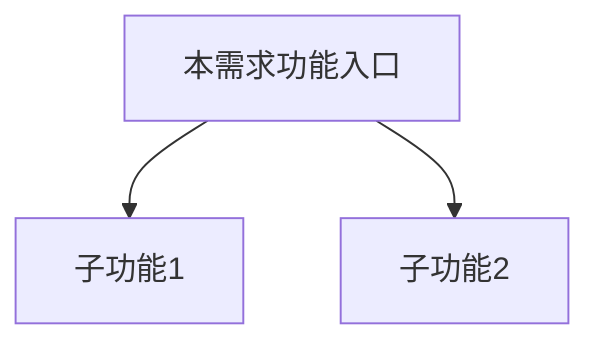
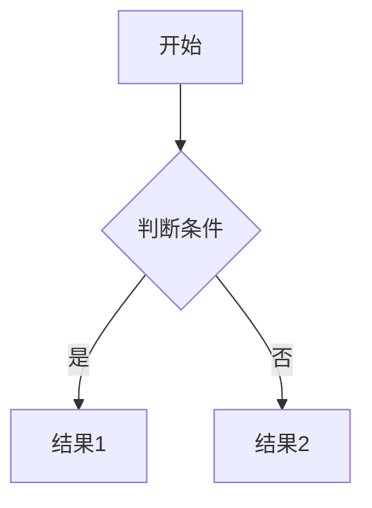
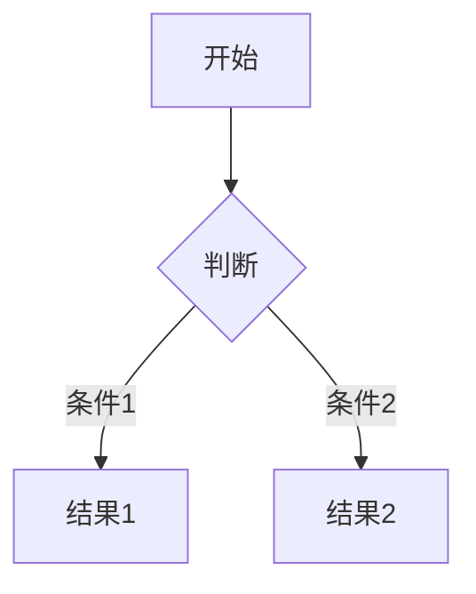

# 功能 PRD 模板（Feature PRD）

> **使用场景**：一个完整功能模块，面向设计、研发、测试多个受众。
> **复制方法**：运行 `/new-prd feature [标题]`，AI 自动从此模板创建。

---

```yaml
---
type: feature-prd
id: F-XXX
title: [标题]
status: draft
version: "1.0"
created: YYYY-MM-DD
updated: YYYY-MM-DD
author:
feature-area:
epic:             # 所属史诗 PRD 的 ID，如 E-001
related-stories:  # 关联的 Story Card，如 [SC-001, SC-002]
has-prototype: false
prototype-path:   # 如有原型：prototype/index.html
---
```

---

# [标题]

## 1 文档元数据

| 字段 | 内容 |
| --- | --- |
| PRD-ID | F-XXX |
| 产品线 | [产品线] |
| 需求类型 | 新功能 / 现有功能优化 |
| 需求状态 | 草稿 |
| 当前版本 | V1.0 |
| 最后更新日期 | YYYY-MM-DD |
| 关键词（Tag） | |
| 关联需求卡片 | drafts/[标题]/rdd.md |
| 关联页面规格卡 | 待产出 |
| 关联原型文件 | 待产出 |

## 2 文档修订记录

| 版本 | 日期 | 修订内容 | 修订人 |
| --- | --- | --- | --- |
| V1.0 | YYYY-MM-DD | 初稿 | [author] |

## 3 需求概要

> 从需求卡片（rdd.md）中摘取关键结论，为阅读 PRD 的人提供最少必要背景，不重复需求分析过程。

### 3.1 问题与机会（概要）

### 3.2 目标用户（概要）

- 核心用户：
- 次级用户：

### 3.3 方案概述

### 3.4 成功指标（3-5 项）

> 上线后通过数据观测判断的业务目标，与功能验收无关，不影响上线决策。

| 指标 | 目标值 | 观测时间 | 数据来源 |
| --- | --- | --- | --- |
| | | | |

---

## 4 需求对象与概念模型

> **编写规则**：只写本 PRD 新引入的业务术语；产品已有术语统一参见 `context/business-glossary.md`，不在此重复定义。
> 无新增术语时保留本章并注明「本需求无新增术语，已有术语参见 context/business-glossary.md」。

| 名词 | 定义 | 约束/备注 |
| --- | --- | --- |
| | | |

---

## 5 功能结构

> **编写规则**：只展示本 PRD 在整体产品结构中新增/调整的节点；完整产品功能树见 `context/product-feature-map.md`。
> 无新增节点时保留本章并注明「本需求无新增功能节点，完整产品结构参见 context/product-feature-map.md」。
> 复杂业务必须提供 Mermaid 代码。

### 5.1 本需求新增/调整的功能节点



### 5.2 本需求核心业务流程



---

## 6 用户故事与用例

> **编写规则**：
> - 用户故事遵循 Mike Cohn 格式（As a / I want / so that）
> - 验收标准（Gherkin）只写上线当天测试人员即可判断通过/不通过的功能行为条件
> - 时间窗口型运营指标（如「上线 N 天后指标下降 X%」）不写在 AC 中，放入 §3.4 成功指标

### 6.1 Epic

[用一句话描述本功能在更大目标中的位置]

### 6.2 Must Have（MVP）

**故事 1：[故事名]**

```text
作为[具体角色]，
我希望[用户行为]，
以便[业务/用户价值]。
```

验收标准（Gherkin）：
- Given [前置条件]
- When [触发动作]
- Then [预期结果]
- And [补充结果]

---

## 7 功能清单（AI 实现主清单）

> **编写规则**：
> - 功能编号格式：`[AREA]-[CATEGORY]-[SEQ]`（如 SEAL-SPECIFY-001）
>   - AREA/CATEGORY = 英文缩写，**先查 `context/product-feature-map.md` 前缀映射表**，已有前缀复用，新模块才推导并记录到映射表
>   - SEQ = 三位补零（001/002/003）
> - 功能名称须**全限定**：含「模块-对象-动词」（如「印章指定-签署区-单独指定」）
> - 动词须具体（创建/删除/校验/生成/关联/过滤），禁止使用「管理/配置/支持」等泛化动词
> - 基础 UI 交互（拖拽、筛选、排序、Toast 等）不单独立项，归入所属功能描述

| 功能编号 | 功能名称（全限定） | 功能描述（Job Story） | 优先级 | 需求来源 |
| --- | --- | --- | --- | --- |
| [AREA]-[CAT]-001 | | 当[场景]时，我想要[动作]，这样我可以[目的] | P1 | 本版 |

---

## 8 功能需求说明书（逐功能展开）

> **编写规则**：
> - 按功能清单逐项展开，一个功能一节，不得跨功能混写
> - §8.x.1-§8.x.3 始终必填
> - §8.x.4-§8.x.9 按条件填写，不适用时保留子节标题并填「不涉及」
> - 页面体验、组件布局、文案等细粒度交互在页面规格卡中承接

---

### [AREA]-[CAT]-001 [功能名称] 需求说明

#### 8.1 任务故事（Job Story）

当[场景]时，我想要[动作]，这样我可以[目的]。

#### 8.2 逻辑实现规范

##### Context（前置条件）

- 条件1
- 条件2

##### Action（触发动作）

1. 用户……
2. 系统……
3. 用户……

##### Outcome（预期结果）

1. **界面变化**：
2. **数据变化**：
3. **反馈提示**：

#### 8.3 异常处理要求

| 异常场景 | 触发条件 | 系统行为（预期结果） |
| --- | --- | --- |
| | | |

#### 8.4 业务流转图（有分支判断时必填，否则填「不涉及」）



#### 8.5 数据字典（有新增/修改字段时必填，否则填「不涉及」）

| 字段名 | 来源页面 | 类型 | 逻辑约束 |
| --- | --- | --- | --- |
| | | | |

#### 8.6 状态流转表（业务对象有生命周期状态时必填，否则填「不涉及」）

| 当前状态 | 触发动作 | 条件（含角色/权限） | 下一个状态 | 失败处理 |
| --- | --- | --- | --- | --- |
| | | | | |

#### 8.7 权限矩阵（涉及多角色时必填，否则填「不涉及」）

> 权限模型参考：`context/permission-model.md`（使用前需初始化）。

| 角色 | 可见范围 | 可执行动作 | 数据范围约束 | 失败提示 |
| --- | --- | --- | --- | --- |
| | | | | |

#### 8.8 边界条件与并发规则（共享资源/并发操作时必填，否则填「不涉及」）

- **数值边界**：
- **时序冲突**：
- **数据依赖**：

#### 8.9 PRD-页面规格卡映射（涉及页面变更时必填，否则填「不涉及」）

| 功能编号 | PRD 章节位置 | 页面规格卡区段 | 页面规格卡状态 | 一致性说明 |
| --- | --- | --- | --- | --- |
| [AREA]-[CAT]-001 | §8 | 待产出 | 待产出 | 待确认 |

---

## 9 非功能性需求

### 9.1 性能要求

| 场景 | 要求 |
| --- | --- |
| | |

### 9.2 安全要求

### 9.3 可用性与可访问性

- 异常提示文案须清晰，包含对象名称和处理建议
- 支持键盘操作（Tab 切换、Enter 确认）
- 图标/缩略图提供 alt 文本

### 9.4 兼容性要求

> 端清单参考：`context/platform-support.md`（使用前需初始化）。
> 只列出本功能存在差异的端；全端一致时填「本功能全端行为一致，无差异」。

| 端 | 差异说明 |
| --- | --- |
| | |

### 9.5 数据统计需求（需求卡片有要求时必填，否则可删除本节）

| 事件对象 | 触发动作 | 事件名 | 属性 | 属性值说明 |
| --- | --- | --- | --- | --- |
| | | | | |

---

## 10 范围外（Out of Scope）

- [明确列出不在本版范围内但容易引起误解的能力]

---

## 11 开放问题

> 评审中待确认的事项，确认后删除或移入对应章节。
> PRD 状态改为 approved 前须清空本节。

| # | 问题 | 提出方 | 状态 |
| --- | --- | --- | --- |
| 1 | | | 待确认 |

---

## 变更记录

> 详细变更历史见同目录 `CHANGELOG.md`。

| 版本 | 日期 | 变更摘要 |
| --- | --- | --- |
| 1.0 | YYYY-MM-DD | 初始版本 |
