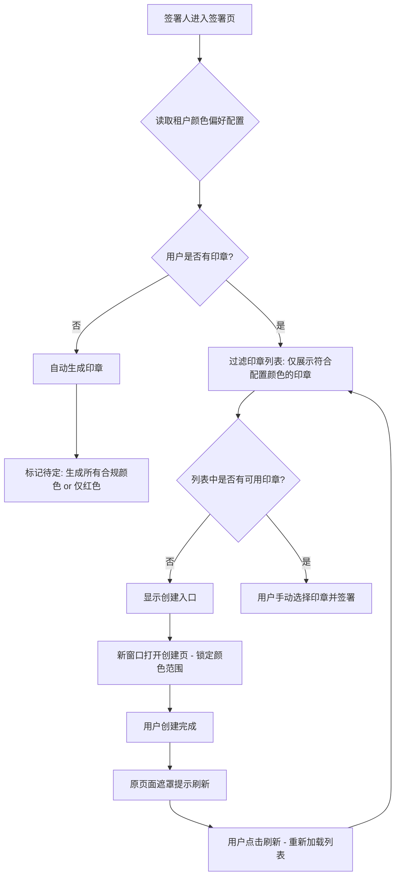

# 指定个人签名印章的模板章以及手绘签名颜色

**修订历史**：

| **日期** | **修改内容** | **责任人** |
| --- | --- | --- |
| 2026-01-29 | 初稿完成：涵盖租户配置、印章过滤及强制颜色创建逻辑 | 三思 |

## 1. 文档概述

### 1.1 需求背景

*   **客户**：通用租户（签署流程发起方）
    
*   **现状**：目前系统中印章颜色由用户自行决定，发起方无法强制要求个人参与方或经办人使用特定颜色的印章加盖。
    
*   **期望**：作为发起方，希望通过租户级的统一配置，确保流程中的个人签名符合品牌或业务合规要求的特定颜色（如红、蓝、黑、紫）。
    

### 1.2 需求范围

*   **后台管理端**：新增租户级印章偏好配置中心。
    
*   **签署页**：印章列表根据配置自动过滤印章颜色。
    
*   **印章创建端**：新增印章时根据配置强制锁定颜色选择范围。
    
*   **兼容性逻辑**：变更仅对后续新发起的流程生效。
    

---

## 2. 需求内容

### 2.1 功能流程图

### 2.2 权限控制

*   **租户管理员**：负责在后台设置中心统一配置颜色偏好（全局生效）。
    
*   **发起方**：本期不开放单个流程的修改控制权限，默认读取租户配置。
    
*   **签署方**：无权修改要求的颜色，仅能在要求的颜色范围内选择或创建印章。
    

### 2.3 功能性需求

| **模块** | **需求描述** |
| --- | --- |
| **平台级配置** | 7488下存在一个手绘章颜色配置，平台优先采用此配置作为默认选项  |
| **租户级配置项** | 管理后台新增“印章颜色偏好设置”，支持： 1. 模板章颜色：红色、黑色、蓝色、紫色（多选） 2. 手绘签名颜色：红色、黑色（多选） 3. 默认值：开启配置后默认勾选红色。  |
| **印章过滤逻辑** | 1. 签署页加载时，请求接口获取当前租户的颜色约束。 2. 过滤当前用户的印章列表，仅显示颜色属性符合配置要求的印章。 3. **系统不默认选中任何印章**，由用户手动点击。 |
| **自动生成逻辑** | 1. 首次访问且无印章时，触发自动生成。 2. **决策**：如果用户指定范围内包含红色，仅默认优先生成红色模板章，未包含红色随机取一个符合要求的颜色。 |
| **创建引导交互** | 1. 若过滤后列表为空，提供“去创建”入口。 2. 交互方式：新开标签页跳转。原签署页显示遮罩弹窗，文案：“你正在进行创建印章操作流程，完成后印章会显示在列表中，请确认后刷新”。 3. **刷新机制**：弹窗内提供“刷新页面”按钮，点击后刷新整个页面。  |
| **创建页限制** | 1. 通过 URL 参数传递颜色约束。 2. 创建页中，颜色选择控件需被锁定，仅允许用户选择发起方指定的颜色范围。 |

以上功能针对**经办人印章**同样生效

---

## 3. 验收标准 (AC)

| **场景** | **验收标准** |
| --- | --- |
| **配置生效校验** | 管理员设置仅允许蓝色，签署人进入页面后，原本的红色、黑色印章不应出现在可选列表中。 |
| **新旧流程兼容** | 流程 A 发起后，管理员修改了配置，流程 A 的签署过程仍保持发起时的颜色要求（或不受限），新发起的流程 B 遵循新配置。 |
| **创建闭环校验** | 签署人点击“去创建”，在弹出页中只能选择符合要求的颜色。创建成功并返回签署页点击刷新后，新创建的印章出现在列表中。 |
| **自动生成校验** | 首次签署用户进入时，系统应至少自动生成一枚符合颜色要求的模板印章（具体策略见待定项）。 |
| **企业经办人印章** | 以上流程在经办人盖章流程中同样生效 |