# 租户级流程中下载权限控制

## 1. 修订历史

| **日期** | **修改内容** | **责任人** | **架构审计结果 (L1-L4)** |
| --- | --- | --- | --- |
| 2026-02-02 | 初版需求定义 | 三思 | **通过** (L1 级原子逻辑沉淀) |

## 2. 文档概述

### 2.1 产品背景与目标

*   **核心定位**：基于“一底多端”架构，电子签名 SaaS 平台需在保证架构一致性的前提下，为不同行业的租户提供差异化的安全管控能力。
    
*   **本次需求**：针对金融、军工等高安全需求租户，需在流程结束前严格限制文件外泄。本需求旨在从 L1 底座层面提供“流程未结束禁止下载”的管控开关，并实现跨端（国内/国际/本地化）的逻辑对齐。
    

### 2.2 合规底线说明

*   **国内站**：符合《电子签名法》中关于数据完整性及安全性的要求。
    
*   **国际站**：需确保在拦截“下载”行为的同时，不违反 eIDAS 框架下关于签署人“审阅权（Right to Review）”的规定（即：允许在线查看，禁止离线物理下载）。
    
*   **本地化 (天印)**：符合《数据安全法》对重要数据流动的管控要求，禁止非法的数据回传。
    

## 3. 需求范围与实现路径

*   **功能清单**：
    
    1.  租户后台增加“流程未结束前允许下载”开关。
        
    2.  流程创建时生成 `download_allow_flag` 状态快照。
        
    3.  L1 底座 `FileService` 增加权限校验拦截。
        

*   **实现路径方案**：
    
    *   **L1 (核心底座)**：在 `Process_Instance` 表新增字段，并在 RPC 接口层实现鉴权逻辑。
        
    *   **L2 (配置项)**：租户后台管理系统（Tenant Admin）通过 BFF 调用底座配置接口。
        

## 4. 功能逻辑

### 4.1 功能流程图 (Mermaid)

```mermaid
graph TD
    A[租户管理员] -->|配置| B(租户级开关: 默认开启)
    C[发起方/BFF] -->|创建流程| D{读取租户配置}
    D -->|Snapshot| E[流程实例快照: IsAllowDownload]
    F[参与方/系统组件] -->|请求下载/同步文件| G{L1 底座鉴权}
    G -->|检查快照| H{IsAllowDownload?}
    H -->|True| I[允许文件流输出]
    H -->|False| J{检查流程状态}
    J -->|未结束| K[拦截: Error 403 / 禁止回传]
    J -->|已结束| I

```

### 4.2 核心业务规则

1.  **快照优先级**：流程一旦创建并被开启，其“下载权限”策略即被锁定，后续租户配置变更仅对新流程生效。
    
2.  **严格逻辑阻断**：当设置为“禁止”时，底座不仅在 UI 层面隐藏按钮，还需要限制跨租户通信时，相对方租户下的文件是否真的可以被下载
    
3.  **流程级控制：**虽然时租户下的发起配置，但是其实是每个流程上都带有了是否与允许下的控制能力
    
4.  具体接入权限方案，由权限团队决策 $\color{#0089FF}{@心瞻-严佳瑞(严佳瑞)}$  $\color{#0089FF}{@陵川-林相德}$ 
    

## 5. 权限控制与多端差异

| **站点类型** | **表现差异** |
| --- | --- |
| **国内站** | 国内站切换时会对已经发起的流程生效，不只是快照逻辑 |
| **国际站** | 国际站切换时只会对后续新发起的流程生效，后续关闭也只对后续新发起的流程生效 |
| **本地化** | \- |

## 6. 功能性需求 (含技术参数)

| **模块** | **细节描述** |  |
| --- | --- | --- |
| **租户级配置入口** | 支持对于是否允许下载进行中的流程合同进行配置 | 国内站：  国际站-偏好设置：  |
| **签署页含预览页（无下载按钮）** | 如果已经完成此设置 A下载页不展示下载按钮 |  |
| **列表页点击下载按钮（含批量下载处理方案）** | A：不展示下载按钮，由国际站的前端承载，后端权限过滤结果已经返回 $\color{#0089FF}{@煜翎-周昱彤(煜翎)}$ |  |

## 7. 验收标准 (AC)

*   **场景 1**：租户 A 关闭下载开关后，新发起的合同在“签署中”状态下，页面不展示下载按钮，且无法下载
    
*   **场景 2**：如果当前参与人员仅有预览权限，未配置下载权限，则无论是否开关均不能下载
    
*   **场景 3**：管理员在流程进行中开启开关，由于“快照逻辑”，该正在进行的流程仍应保持“禁止下载”状态。