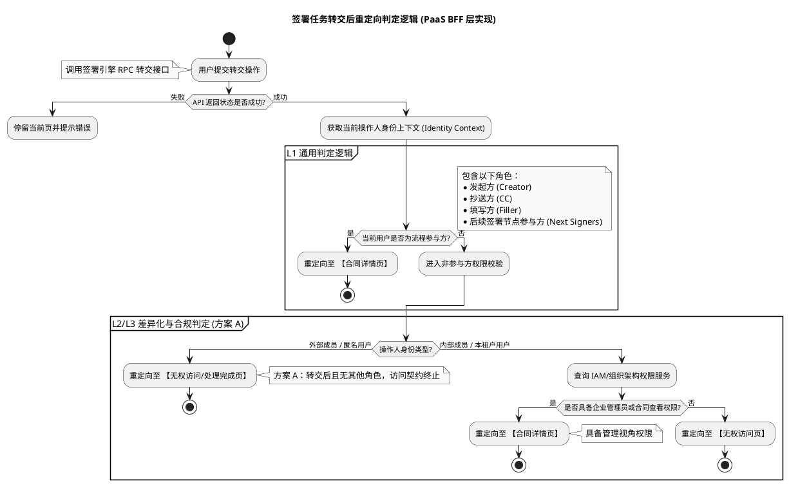

# 转交信封用户重定向逻辑补充

```plantuml
@startuml
title 签署任务转交后重定向判定逻辑 (PaaS BFF 层实现)

skinparam ConditionEndStyle hline
skinparam monochrome true
skinparam shadowing false

start

:用户提交转交操作;
note left: 调用签署引擎 RPC 转交接口

if (API 返回状态是否成功?) then (失败)
  :停留当前页并提示错误;
  detach
else (成功)
  :获取当前操作人身份上下文 (Identity Context);
  
  partition "L1 通用判定逻辑" {
    if (当前用户是否为流程参与方?) then (是)
      note right
        包含以下角色：
        * 发起方 (Creator)
        * 抄送方 (CC)
        * 填写方 (Filler)
        * 后续签署节点参与方 (Next Signers)
      end note
      :重定向至 【合同详情页】;
      stop
    else (否)
      :进入非参与方权限校验;
    endif
  }

  partition "L2/L3 差异化与合规判定 (方案 A)" {
    if (操作人身份类型?) then (外部成员 / 匿名用户)
      :重定向至 【无权访问/处理完成页】;
      note right: 方案 A：转交后且无其他角色，访问契约终止
      stop
    else (内部成员 / 本租户用户)
      :查询 IAM/组织架构权限服务;
      if (是否具备企业管理员或合同查看权限?) then (是)
        :重定向至 【合同详情页】;
        note right: 具备管理视角权限
        stop
      else (否)
        :重定向至 【无权访问页】;
        stop
      endif
    endif
  }
endif

@enduml
```