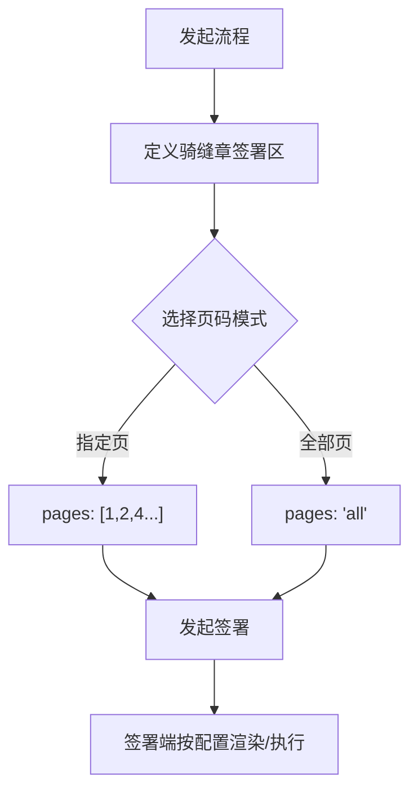

# 骑缝章签署区能力覆盖国际站

## 1. 修订历史

| **日期** | **修改内容** | **责任人** | **架构审计结果 (L1-L4)** |
| --- | --- | --- | --- |
| 2026-02-02 | 初版：定义骑缝章签署区及其页码范围逻辑 | 三思 | **通过**。采用 L1 底座化路径，将 `page_range` 抽象为签署区固有属性。 |
| 2026-02-10 | 方案变更：骑缝签署区编辑页/指定位置页交互方案调整 | 长今、三思 |  |

## 2. 文档概述

### 2.1 产品背景与目标

*   **核心定位**：电子签名 SaaS 平台核心签署模块（PaaS 引擎：一底多端）。
    
*   **本次需求**：旨在解决现有国际站签署流程不支持骑缝章控件的能力要求。通过在 L1 底座增加骑缝章签署能力，支撑发起方精准控制盖章范围，同时满足不同站点（国内/国际）对骑缝章的差异化展示需求。
    

### 2.2 合规底线说明

*   **《电子签名法》要求**：确保骑缝章加盖后，文档每一页的完整性均可被验证。
    
*   **数据安全考量**：针对非连续页码（如 1, 2, 4）签署，系统需确保未勾选页（第 3 页）在数字摘要计算中不被错误包含或篡改。
    

## 3. 需求范围与实现路径

*   **功能清单**：
    
    1.  **RPC 协议扩展**：签署区 Field 对象支持多页码数组。
        
    2.  **发起侧控制**：支持设置“全部页”或“自定义页（含非连续页）”，支持锁定或开放印章样式。
        
    3.  **签署侧适配**：根据发起侧指令，实现样式的锁定渲染或动态选择。
        

*   **实现路径方案**：**L1 通用底座化**。
    
    *   **核心层 (RPC)**：新增骑缝章类型
        

## 4. 功能逻辑

### 4.1 功能流程图 (Mermaid)

### 4.2 核心业务规则 (含 L1-L4 考量细节)

1.  **页码存储 (L1)**：底层不进行连续性校验，`pages` 字段作为物理加盖的唯一参考依据。
    
2.  **样式下发 (L2)**：BFF 层根据签署区类型过滤可用样式。例如：国际站需要支持拖入图章控件与签名控件
    
3.  **渲染优先级**：发起方指定样式优先级 > 参与方默认样式 > 系统全局配置。
    

## 5. 权限控制与多端差异

**签署控件，无特殊权限**

**产品规格：全版本可用**

## 6. 功能性需求 (含技术参数)

| **模块** | **细节描述** | **备注** |
| --- | --- | --- |
| **发起签署时指定骑缝章** | ~~需要能够支持拖入骑缝章控件指定盖章位置，默认不限制可拖入的印章类型~~ ~~需要支持指定页数或全部页~~ **方案变更啦！请看最后** | ~~如果当前文档只有一页，不支持拖入此控件~~ ~~**骑缝章增加属性，限制印章类型**~~ *   ~~**图章（默认）**~~      *   ~~**签名**~~       |
| **签署页（指定页）PC&H5** | 展示骑缝章控件，点击控件后选择印章范围需要依据指定位置过滤（图章或签名） |  |
| **签署页（自由签）PC&H5** | 展示加盖骑缝章入口，点击后展示骑缝章区域。可拖入图章控件或签名控件，控件可以支持点击后选择印章。 | 如果当前文档只有一页，不展示骑缝章入口 自由签不支持换章 (OPENAPI没法感知页数，需要 $\color{#0089FF}{@煜翎-周昱彤(煜翎)}$ 国际站需要提供感知页数的能力否则无法后端拦截) |
| **各类TSP支持骑缝章** | 原文TSP无法支持骑缝章 P7与P1的TSP可以支持骑缝章 | 理应目前国际站的所有TSP都能支持骑缝章（含国内站TSP） |

## 7. 验收标准 (AC)

| **场景** | **验收标准** |
| --- | --- |
| **发起方：指定页码范围** | 1. 发起页面支持勾选“全部页”或“指定页”； 2. 输入非连续页码（如 1, 3, 5）时，系统需准确记录并透传至底层 RPC `pages` 字段。 |
| **发起方：指定盖章样式** | 1. 发起方可下拉选择该站点支持的骑缝章样式 2. 选中特定样式后，配置信息需持久化至签署节点属性中。 |
| **自由签自主选择** | 1. 若发起方未锁定样式，参与方进入签署页面时，样式选择器处于可用状态； 2. 参与方切换样式时，签署区预览区域需实时渲染对应的样式效果。 |
| **参与方：受控签署行为** | 1. 若发起方已指定样式，参与方签署时无法新增骑缝章 2. 参与方点击“签署”后，系统仅在指定的 `pages` 范围内加盖印章，非目标页（如 1, 3, 5 中的第 2 页）必须保持无章状态。 |
| **异常场景：超限校验** | 1. 若指定的页码超出了文档实际总页数，需要拦截报错 |

---

## 8、方案变更\-模板编辑页/发起签署时指定位置页骑缝章调整

### 1、模板编辑页/指定位置页、填签一体页页面对于骑缝签署区的交互一致：

**（1）没有“骑缝签署区”控件，有一个展开收起的骑缝区域，拖入此区域的控件就带有骑缝章的属性**

*   默认收起，点击展开，交互见设计稿：[https://www.figma.com/design/3Cep9ZNCydxU4msGocAxEH/epaas-%E7%AD%BE%E7%BD%B2?node-id=3437-2571&t=cfGvgGXMo8iQ0KVs-0](https://www.figma.com/design/3Cep9ZNCydxU4msGocAxEH/epaas-%E7%AD%BE%E7%BD%B2?node-id=3437-2571&t=cfGvgGXMo8iQ0KVs-0)
    
*   只有 签署区、图章区、签名区、骑缝签署区类型的控件（包括基础控件和业务控件）可以拖入这个区域，其他控件不支持（未来有其他可以支持拖入的控件要支持可扩展）
    
    *   注意：国内站部分业务控件是骑缝签署区，此时拖入底稿后，看下是否可以默认展开并且落入骑缝签署区
        
*   骑缝区域展开时：
    
    *   拖入允许骑缝的控件类型时，如果控件落在骑缝区域内，则直接落入骑缝区域；如果控件落在非骑缝区域内，则落入非骑缝区域的位置（不会被吸到骑缝区域）；如果落在中间，则默认归到骑缝区域（UED定边界）
        
    *   拖入不允许骑缝的控件类型时，掠过骑缝区域时，有个禁用图标，此时松手则控件不会落入，只有在非骑缝区域才会落入（UED定交互）
        
    *   非骑缝区的控件和骑缝区的控件不允许相互换位置
        
*   骑缝区域收起时：
    
    *   正常落入所有可放置的区域
        
*   落入骑缝区域后，控件属性的变化：
    
    *   签署区：去掉“显示签署日期”、“落章规则”；应用页面属性去掉当前页
        
    *   图章区/签名区：去掉“落章尺寸规则”；应用页面属性去掉当前页
        
*   落入骑缝区域后，给到业务和openapi的控件类型还是骑缝签署区
    

**（2）后端不动，业务对接/openapi不影响**

*   公有云/天印签署无需重新对接，openapi无需重新对接，无论是历史数据还是新数据，只要是在骑缝签署区区域内的，都是按照原有骑缝签署区类型对接
    
*   国际站openapi设置骑缝签署区按照新的对接？（本期不做，后续会要做）
    

**（3）静态模板、动态模板、PC、H5都是一样的**

### 2、国内站灰度计划和上线时间：

**公有云/天印：**

*   模板编辑页/指定位置页按照上述方来执行
    
    *   公有云按照OID灰度（每周25%，1个月内完成灰度），天印无灰度
        
*   填签页/签署页和现状一致（交互优化不需要灰度，可以直接上）
    
    *   交互优化1：骑缝区域高亮蓝色+文字
        
    *   交互优化2：非骑缝区域的章/签名不会被吸入骑缝区
        
    *   交互优化3：H5展开骑缝区域的时候，把签署日期/备注签署区等不支持的控件拖入时，没有任何反应，就会变成长按触发对页面内容的一些操作，交互需要优化
        
*   灰度上线时间：0319？
    
*   通知前线？——详细设计评审完确定方案和上线日期再通知