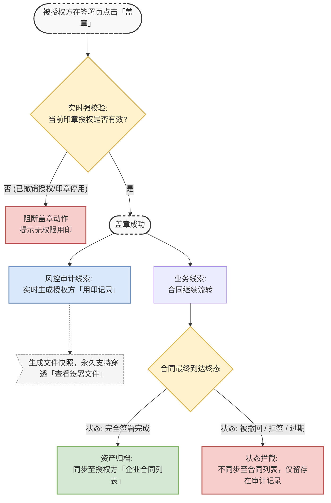

# 《跨企业印章授权：数据隔离与技术选型决策方案》

## （1）需求背景

在跨企业印章授权的业务场景中，核心矛盾在于\*\*“被授权方的业务流转自由度”与“授权方的数据主权及风控审计要求”之间的平衡\*\*。

当被授权方调用授权方印章进行认签时，授权方必须具备完备的用印知情权和事后审计能力。本次评审旨在明确底层数据存储的技术选型（跨租户授权 vs. 跨租户复制），并在保证合规风控底线的前提下，统一前端产品呈现的业务逻辑，确保系统架构的高内聚与低耦合，为后续的产品研发提供明确的统一标准。

## （2）功能现状

目前针对跨企业授权用印场景，产品在业务隔离与风控留痕上已确立以下核心逻辑：

1.  **企业合同列表（资产隔离）**：仅作为最终生效资产的归档库。只有合同最终流转为\*\*“完全签署完成”\*\*时，才会跨企业同步至授权方的合同列表中。拒签、撤回、过期等异常/中间状态均被拦截。
    
2.  **用印记录（实时审计）**：作为风控监控室，只要产生真实的盖章动作，立即在授权方生成记录。授权方可通过【查看签署文件】穿透查看当时的文件快照。
    
3.  **强鉴权机制**：在前端点击“盖章”的瞬间进行印章状态和授权有效性的实时强校验，而非依赖发起时的状态。
    

**核心流转流程图如下：**

## （3）技术方案选型与建议

针对底层数据的跨租户流转，目前有两种技术备选方案。

*   **方案 A：跨租户授权方案（基于数据引用）**
    
    *   **机制**：授权方的“用印记录”底层只存储一个指向被授权方租户空间内源文件的“引用链接（View）”。
        
    *   **致命风险**：如果被授权方在自身系统内物理删除了该合同/信封资源，授权方的引用链接将直接失效（空指针）。这会导致授权方的用印审计证据链断裂，产生严重的合规漏洞，无法满足 B 端企业对\*\*“数据绝对主权”\*\*的核心诉求。
        
*   **方案 B：跨租户复制方案（基于数据冗余）**
    
    *   **机制**：在特定节点，将底层业务数据（包含文件实体）物理复制（Copy）一份到授权方的租户隔离空间内，作为独立资产管理。
        
    *   **挑战**：复制时机的选择。若签署完成才复制，中间态无法查看文件；若用印即复制，需解决状态展示的隔离问题。
        

**✅ 最终架构建议：采用“方案 B” + “落章即异步复制”**

坚决摒弃方案 A。采用方案 B，并在被授权方\*\*“落章成功”的瞬间，触发底层数据的物理复制\*\*至授权方租户。此举彻底斩断了两家企业的数据物理耦合，确保即使被授权方注销账号，授权方的风控审计证据依然永久、完整存续。

## （4）产品设计的变更方案说明以及为什么建议不行

在确认底层采用“方案 B（用印即复制）”后，产生了一个衍生产品设计变更讨论：

> **变更提议**：既然底层在“用印瞬间”就已经把合同数据复制到了授权方租户下，是否干脆调整产品展现逻辑——**在“企业合同列表”中直接展示该合同，且不隐藏“签署中”、“被撤回”、“已拒签”等异常结束流程？**

**❌ 决议：坚决否决此变更提议，维持现有产品设计的严格隔离。**

**驳回理由与业务推演如下：**

1.  **破坏核心模块的业务定位（资产库 vs. 监控室）**
    
    *   **企业合同列表**的定位是“企业资产保险箱”，沉淀的是具备法律效力、产生业务约束的正式文件。
        
    *   **用印记录**的定位是“风控监控室”，侧重于动作的审计。
        
    *   如果将废弃的流程（撤回/拒签）和进行中的流程（签署中）混入合同列表，将彻底模糊“资产”与“日志”的边界，违背电子合同管理的本质诉求。
        
2.  **引发严重的跨企业“数据污染”**
    
    *   在跨企业场景中，发起动作由外部被授权方主导。如果放开中间态展示，被授权方员工的任何误操作（例如：发起后发现错别字立即撤回重发），都会在授权方的正式合同列表中生成大量“业务垃圾”。授权方作为被动接受者，其列表视角的清爽度将遭到毁灭性破坏。
        
3.  **无视不同角色的真实诉求（Role-Based 体验冲突）**
    
    *   **法务/财务/业务（看列表的人）**：诉求是高效筛选“已生效”的合同以推进付款或履约。掺杂大量无效的跨企业废单，极大地增加了他们的认知负荷和工作成本。
        
    *   **合规/印章管理员（看记录的人）**：诉求是追踪印章去向。目前的“用印记录”已完全满足该诉求。
        

**🎯 最终执行标准**

**“底层数据冗余复制，前端视图严格克制”**。

底层实施方案 B 保障数据主权；但在产品层，通过引入状态隔离字段（如 `is_archived_to_list`），**坚守防线，绝对不允许非“完全签署完成”状态的合同进入授权方的企业合同列表**。

---

**下一步操作建议：**

您可以直接将这份材料带入评审会议。如果会议中研发团队对“视图如何具体隔离”提出疑问，需要我为您准备一套简短的“数据库状态字段流转策略”作为您的防御话术吗？