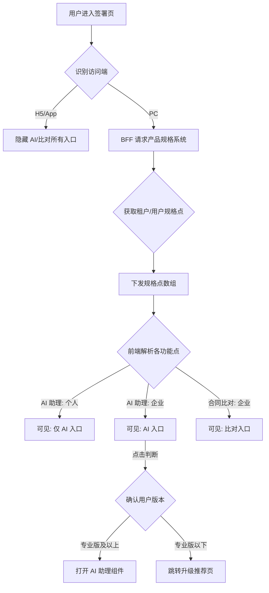

# 接入产品规格，支持在签署页展示AI助理和合同比对入口

## 1. 修订历史

| **日期** | **修改内容** | **责任人** | **架构审计结果 (L1-L4)** |
| --- | --- | --- | --- |
| 2026-02-11 | 初稿：定义 AI 助理与合同比对入口权限及引导逻辑 | 三思 | **L2 级别**：配置化驱动，底座无污染 |

## 2. 文档概述

### 2.1 产品背景与目标

*   **核心定位**：基于“一底多端”PaaS 引擎，通过外挂的**产品规格系统 (PSS)** 实现签署页插件能力的动态发现与差异化分流。
    
*   **本次需求**：解决个人与企业用户在签署页使用 AI 助理、合同比对功能的入口展示、权限校验及商业转化引导逻辑，提升增值服务的转化效率。
    

### 2.2 合规底线说明

*   **数据隔离**：AI 助理调用时，可以考虑BFF必须根据路由至对应地区的 AI 服务（如国内站使用国产大模型，国际站使用符合 eIDAS 的合规模型）。
    
*   **权限一致性**：必须确保前端展示权限与后端 RPC 接口校验权限在 产品规格系统中配置一致，严防通过 URL 越权调用。
    

## 3. 需求范围与实现路径

*   **功能清单**：
    
    1.  AI 助理入口可见性与执行逻辑。
        
    2.  合同比对入口可见性与执行逻辑。
        
    3.  终端过滤（PC 端展示，H5 隐藏）。
        

*   **实现路径方案**：
    
    *   **路径**：**L2 配置项优先**。
        
    *   **机制**：签署页前端插件加载时，请求 BFF；BFF 调用“产品规格系统”获取能力矩阵（Capabilities），下发至前端。
        

## 4. 功能逻辑

### 4.1 功能流程图 (Mermaid)

### 4.2 核心业务规则

*   **依赖产品规格系统控制按钮显隐以及展示内容：**
    
*   **合同比对功能key：ai\_tools\_comparison**
    
*   
    
*   
    
*   **合同Agent功能key：**
    

## 5. 权限控制与多端差异

| **站点/终端** | **用户身份** | **功能入口** | **交互表现** |
| --- | --- | --- | --- |
| **国内站-PC** | 个人 (含VIP) | AI 助理 | 点击跳转引导页 |
| **国内站-PC** | 企业体验版 | AI + 比对 | AI助理点击跳转引导页 AI比对直接使用 |
| **国内站-PC** | 企业专业版及以上版本 | AI + 比对 | 直接使用 |
| **国际站-PC** | 企业用户 | AI 助理 | 依据国际站要求控制 |
| **所有站点-H5** | 所有用户 | 增值入口 | **完全隐藏** |

详细UI出图按照UI提供内容服务

## 6. 验收标准 (AC)

| **场景** | **验收标准** |
| --- | --- |
| **AC-1 终端隔离** | 使用移动端 H5 打开签署链接，确认页面不加载 AI 及合同比对按钮。 |
| **AC-2 个人权限** | 个人用户（含 VIP）登录签署页，确认仅可见 AI 助理，无合同比对入口。 |
| **AC-3 企业转化** | 体验版企业用户点击 AI 助理，页面应正确根据 PSS 配置跳转至指定的升级引导页。 |
| **AC-4 后端拦截（本次不涉及）** | 手动构造 AI 助理 RPC 请求，若当前企业为体验版，BFF 应拦截后端请求？ |