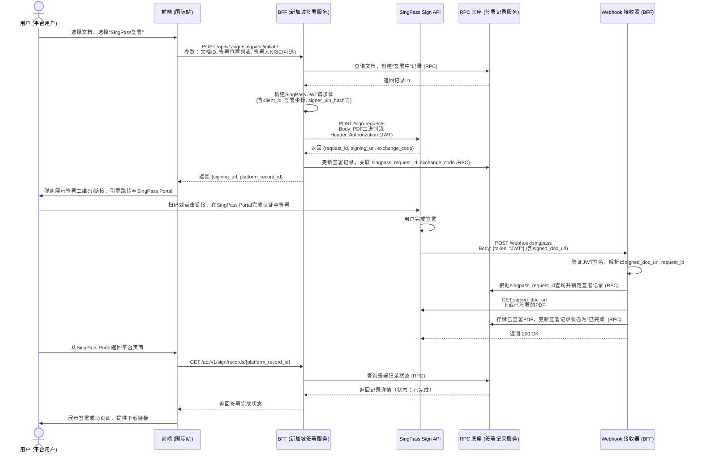

# 支持SingPass原文签署TSP能力

### 1. 修订历史

| 日期 | 修改内容 | 责任人 | 架构审计结果 (L1-L4) |
| --- | --- | --- | --- |
| 2024-05-20 | 初稿创建，定义新加坡站 SingPass 签署集成方案。 | 产品架构组 | L2 (路径实现：BFF编排) |

### 2. 文档概述

**2.1 产品背景与目标**

*   **核心定位**：本需求旨在为电子签名 SaaS 平台的国际站（新加坡区域）集成新加坡政府官方数字身份与签署服务 **Sign with Singpass**，作为 PaaS 引擎“一底多端”中国际站的一种法定签署方式，丰富平台的签署渠道并满足当地合规要求。
    
*   **本次需求**：
    
    *   **现状痛点**：平台用户在新加坡开展业务时，缺乏被当地广泛认可、具有法律效力的数字签署方式，影响业务闭环与信任度。
        
    *   **期望目标**：实现 RP (Relying Party) 模式对接 SingPass Sign API V3，允许平台用户在新加坡站发起签署流程，指定签署人，并通过 SingPass 完成具有法律效力的电子签名，签署结果可验证、可追溯。
        

**2.2 合规底线说明**

*   **法律效力**：Sign with Singpass 产生的签名符合新加坡《电子交易法》(Electronic Transactions Act 2010) 对 **安全电子签名 (SES)** 的定义，在新加坡境内具有法律效力。
    
*   **数据合规**：
    
    *   **数据传输**：平台与 SingPass API 的所有通信必须通过 HTTPS 加密，确保传输层安全。
        
    *   **数据存储**：原始及签署后的 PDF 文档由平台负责存储与管理，需遵循新加坡《个人数据保护法》(PDPA) 及平台用户协议。SingPass 仅临时处理文档用于签署，不长期留存。
        
    *   **身份认证**：通过 SingPass 完成强身份认证，符合新加坡数字身份框架，满足 eIDAS 对高级电子签名 (AdES) 的身份认证要求。
        

### 3. 需求范围与实现路径

**功能清单**：

1.  **签署流程发起**：创建 SingPass 签署会话，生成签署链接。
    
2.  **签署人指定**：支持通过 NRIC Hash 指定唯一签署人。
    
3.  **签署位置与数量控制**：支持定义一个或多个（最多20个）签署坐标位置。
    
4.  **签署结果接收**：通过 Webhook 接收签署成功通知，并获取签署后文档。
    
5.  **签署结果查询**：支持通过 API 主动查询签署结果。
    
6.  **签署流程取消**：支持取消未完成的签署请求。
    

**实现路径方案**：

*   **路径**：**BFF (Backend for Frontend) 逻辑编排**。
    
*   **说明**：SingPass 的签署逻辑、状态机、Webhook 回调处理等均为其特有流程，不适合下沉至 RPC 底座。应在国际站的 BFF 层进行封装，对外暴露统一的“发起签署”、“查询结果”等接口。RPC 底座仅提供基础的“签署记录”数据模型与存储服务。配置项（如 SingPass 开关、密钥配置）在平台配置中心管理。
    

### 4. 功能逻辑

**4.1 功能流程图**

**4.2 核心业务规则**

*   **L1 通用逻辑 (RPC底座)**：
    
    *   签署记录模型：`SignRecord` 表应包含通用字段：`id`, `document_id`, `status`, `signer_info`, `sign_type`, `created_at` 等。
        
    *   对于 SingPass 类型，存储扩展字段：`singpass_request_id`, `singpass_exchange_code`。
        
*   **L2 国际站差异化 (BFF编排)**：
    
    *   **签署位置**：在调用 SingPass API 前，BFF 需将平台定义的“签署块”坐标转换为 SingPass 要求的 `(x, y, page)` 相对坐标格式（0-1之间）。
        
    *   **签署人指定**：若指定了 `signer_uin_hash`，必须确保 NRIC Hash 计算正确（SHA256，大写）。SingPass 将强制校验。
        
    *   **Webhook处理**：BFF 需实现一个公网可访问的 Webhook 接口。收到通知后，必须立即下载文档（链接2分钟有效），并调用 RPC 更新状态。处理需保证幂等性。
        
    *   **结果查询**：作为 Webhook 的补充，BFF 提供查询接口，供前端轮询或用户手动查询。查询时需使用 `exchange_code` 构建新的 JWT 进行认证。
        
    *   **取消逻辑**：调用 SingPass 取消接口前，需通过 RPC 锁定对应的签署记录，防止并发冲突。
        

### 5. 权限控制与多端差异

| 站点/权限 | 功能可见性 | 数据隔离 | UI/UX差异 |
| --- | --- | --- | --- |
| **国际站(新加坡)** | **可见**。作为核心签署方式之一。 | 数据完全隔离。签署记录与文档存储于国际站数据库。 | 需集成 SingPass 官方签署按钮样式（红色/白色），遵循其 UX 指南。 |
| **国际站(其他地区)** | 不可见。 | 不涉及。 | 不涉及。 |
| **国内站** | 不可见。 | 不涉及。 | 不涉及。 |
| **本地化(天印)** | 不涉及。需根据私有化部署客户是否处于新加坡单独评估。 | 若部署，数据在客户私有环境。 | 若部署，需适配客户内网与SingPass API的连通性。 |

### 6. 功能性需求 (技术参数)

**模块：BFF - SingPass 签署服务**

| 接口 | 参数/字段 | 说明 | 默认值/约束 |
| --- | --- | --- | --- |
| **POST /api/v1/sign/singpass/initiate** | `document_id`: string `sign_locations`: array\[{x, y, page}\] `signer_nric`: string (可选) | 发起签署。 `sign_locations` 需校验数量 <= 20。 `signer_nric` 将在内部转为 `signer_uin_hash`。 | `signer_nric` 需符合新加坡NRIC格式。 |
| **响应** | `signing_url`: string `platform_record_id`: string | `signing_url` 有效期30分钟。 |  |
| **Webhook: POST /webhook/singpass** | `token`: string (JWT) | 接收 SingPass 通知。JWT 内含 `signed_doc_url`, `request_id`, `signer_info`。 | 必须验证 JWT 签名（使用 SingPass 公钥）。 |
| **处理逻辑** | 1. 验签。 2. 根据 `request_id` 查询 `SignRecord`。 3. 下载 PDF。 4. 调用 RPC `UpdateSignRecord`。 | 处理超时或失败需记录日志并重试（可配置策略）。 |  |
| **GET /api/v1/sign/records/{record\_id}** | `record_id`: string | 查询签署状态，供前端轮询。 | 状态映射：SingPass状态 -> 平台通用状态（待签、已完成、已取消）。 |
| **POST /api/v1/sign/singpass/{record\_id}/cancel** | `record_id`: string | 取消签署。内部调用 SingPass `/sign-requests/cancel` API。 | 仅在状态为“待签”时允许调用。 |

**模块：配置管理**

*   **配置项**：`singpass.enabled` (布尔), `singpass.client_id` (字符串), `singpass.jwks_url` (字符串), `singpass.api_base_url` (字符串)。
    
*   **设计**：在平台配置中心按“区域”维度进行配置，国际站新加坡区域启用，其他区域禁用。
    

### 7. 验收标准 (AC)

| 场景 | 验收标准 |
| --- | --- |
| **AC1: 成功发起签署** | 1. 国际站新加坡用户选择文档、定义签署位置后，可选择“SingPass签署”。 2. 成功生成签署链接与二维码。 3. 后台 `SignRecord` 记录已创建，状态为“待签”。 |
| **AC2: 指定签署人** | 1. 发起时指定了有效的 NRIC。 2. 仅该 NRIC 对应的 SingPass 用户扫码后能进入签署页面。 3. 其他用户扫码后看到“非指定签署人”错误页面。 |
| **AC3: 多位置签署** | 1. 发起时定义了5个签署位置。 2. 用户在 SingPass Portal 需依次确认5个位置。 3. 最终签署的 PDF 在对应位置出现有效的签名块。 |
| **AC4: Webhook接收与文档处理** | 1. 用户在 SingPass 完成签署后，平台 Webhook 在 10秒内收到通知。 2. 平台成功下载已签署的 PDF。 3. `SignRecord` 状态更新为“已完成”，并关联签署后文档。 |
| **AC5: 主动查询结果** | 1. 签署流程中断或 Webhook 未触发。 2. 前端调用查询接口，能正确返回当前状态（待签/已完成）。 3. 若已完成，能返回下载链接。 |
| **AC6: 取消签署** | 1. 对一个“待签”状态的流程发起取消。 2. 取消成功，SingPass 链接失效。 3. `SignRecord` 状态更新为“已取消”。 |
| **AC7: 多端隔离** | 1. 国内站、国际站（非新加坡）用户界面无“SingPass签署”选项。 2. 国际站新加坡用户的签署数据与其他区域数据完全隔离存储。 |

**关键约束**：

1.  **架构约束**：所有 SingPass 特有逻辑必须封装在 BFF 层，严禁在 RPC 底座代码中出现 `if region == "singapore"` 这类硬编码判断。区域特性通过配置项和 BFF 路由实现。
    
2.  **接口兼容性**：BFF 对前端暴露的接口（如 `/initiate`）签名应尽量与平台现有签署接口保持一致，降低前端集成成本。
    
3.  **错误处理**：必须妥善处理 SingPass API 返回的各种错误码（如 `UNAUTHORIZED`, `DOCUMENT_ALREADY_SIGNED`），并转换为平台统一的错误码和用户提示。
    
4.  **安全性**：`exchange_code`、平台用于调用 SingPass 的私钥等敏感信息，必须加密存储于平台密钥管理服务中。
    

---

singpass接口页面：