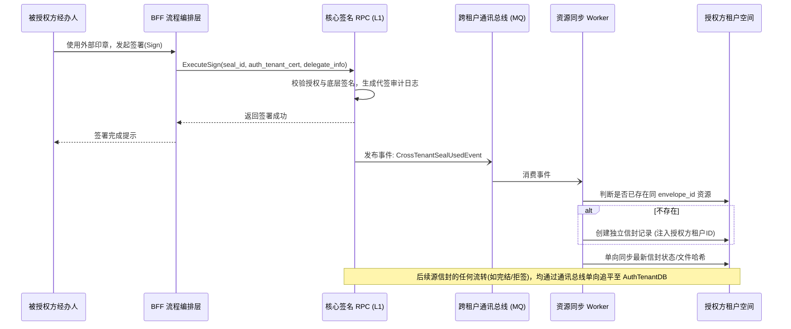
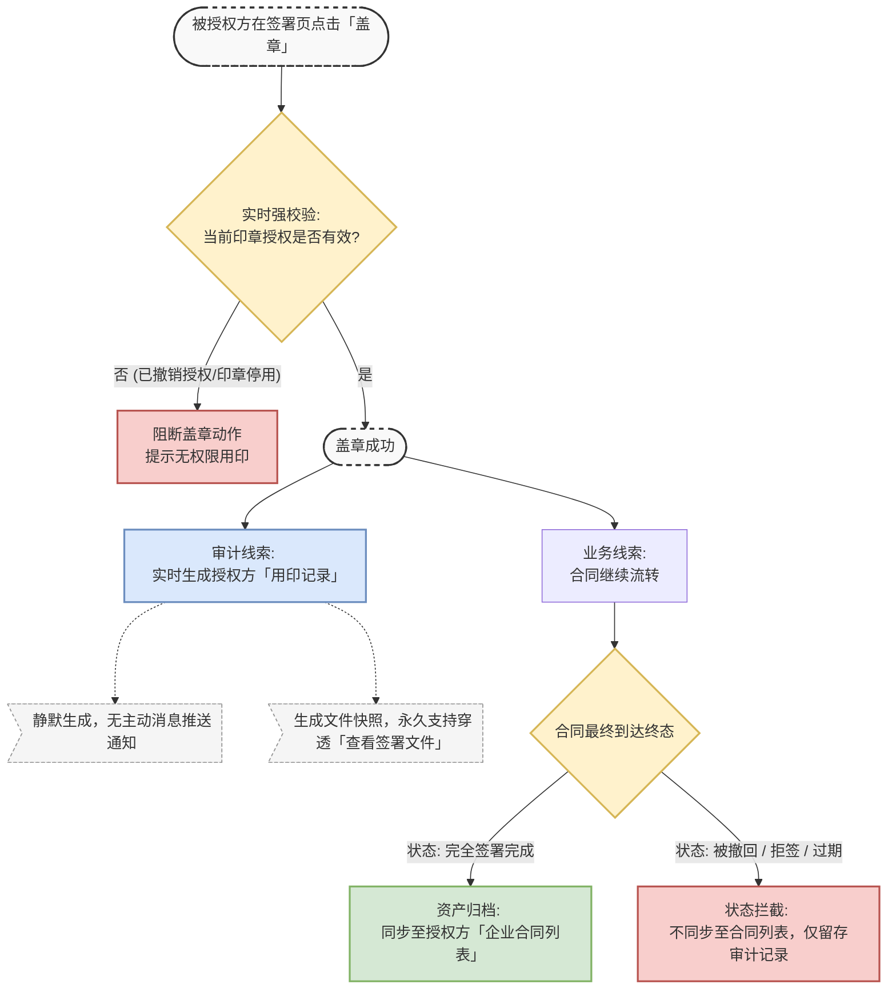

# 跨企业印章授权

## 1. 修订历史

| **日期** | **修改内容** | **责任人** | **架构审计结果 (L1-L4)** |
| --- | --- | --- | --- |
| 2026-03-09 | 初始版本：创建“被授权方使用印章落款”需求 | 三思 | **Pass**。L1 底座承接核心逻辑；L2 配置项隔离多端。 |
| 2026-03-09 | 补充需求：落款后触发跨企业信封资源单向复制同步 | 三思 | **Pass**。复用底座跨租户通讯机制与物理隔离模型，无主键冲突风险。 |

## 2. 文档概述

### 2.1 产品背景与目标

*   **核心定位**：基于电子签名 SaaS 平台核心签署模块（PaaS 引擎：一底多端），提供高内聚、低耦合的签署能力。
    
*   **本次需求**：在企业间委托代办、业务外包等场景中，受托方（被授权企业）的经办人需要使用委托方（授权企业）的印章完成合同签署。期望通过本需求，打通跨租户印章调用的业务闭环。
    
*   **增量目标**：在授权印章被调用后，依托底座跨租户通讯机制，将当前信封流程（保持 `envelope_id` 不变）同步至授权方企业的合同列表中，便于授权方基于内部权限进行统一归档与管理。
    

### 2.2 合规底线说明

*   **电子签名法与数字证书**：底层加密哈希运算必须且只能使用**授权企业**的国密 SM2 算法相关的 CA 证书或RSA证书，确保法律效力归属于授权方。
    
*   **审计与数据隔离**：底层日志需不可篡改地记录物理操作人与意愿主体的代签映射关系。复制到授权方的信封实体必须遵循严格的多租户数据隔离原则，仅做状态的“单向接收”，授权方的本地化修改（如内部标签）不得逆向污染发起方（源租户）的信封数据。
    

## 3. 需求范围与实现路径

| **功能清单** | **描述** | **实现路径方案** |
| --- | --- | --- |
| 印章列表区分 | 签署面板区分“本企业印章”与“外部授权印章” | **BFF 逻辑编排 + 前端插件化**：BFF 聚合权限并打标，前端按标签渲染分组。 |
| 授权有效期校验 | 仅在授权有效期内展示并允许使用外部印章 | **BFF 逻辑编排**：签署请求前置拦截。 |
| 跨租户代签记录 | 签署日志及合同存证流中记录代签关系 | **L1 通用底座能力**：RPC 核心接口透传泛化参数，底层生成落链日志。 |
| 跨租户信封同步 | 授权印章落款后，在授权方租户内生成同 ID 信封 | **L1 跨租户通讯机制**：基于 Event-driven（事件驱动）的异步资源复制与单向状态同步机制。 |
| 多端业务开关 | 仅国内站开放，国际站及天印本地化隐藏 | **L2 配置项优先**：通过租户/站点级产品规格配置开关控制。 |

## 4. 功能逻辑

### 4.1 功能流程图

### 4.2 核心业务规则

*   **代签执行与底座记录 (L1)**：
    
    *   当传入合法的 `delegate_tenant_id` 和 `delegate_operator_id` 时，使用外部印章所在租户的证书签名，并将代签映射关系写入底座的不可篡改审计日志中。
        
*   **跨租户信封同步 (L1)**：
    
    *   **触发时机**：只要外部授权印章在某个信封中被成功加盖，无论该信封整体流程是否结束，底座即刻触发跨租户通讯事件。
        
    *   **资源隔离**：在授权方（Tenant A）租户空间内生成一条独立的信封记录，保持 `envelope_id` 与被授权方（Tenant B）源信封绝对一致。
        
    *   **权限归属**：该信封实体在 Tenant A 内部的表现与常规信封无异，适用 Tenant A 的全套角色与权限路由规则（可见性、文件夹归档等）。但 Tenant A 并非此签署流程的法定“参与人（Participant）”。
        
    *   **单向状态同步**：Tenant B 源信封的状态变更（如他人签署、撤回、完结）通过异步 MQ 单向覆写 Tenant A 的核心状态字段；Tenant A 对该信封的本地化操作（如打标签、内部归档）不可逆向同步给 Tenant B。
        
*   **环境与多端隔离 (L2)**：
    
    *   国际站、本地化(天印)站点通过全局开关 `ENABLE_CROSS_TENANT_SEAL` 默认关闭此功能，BFF 拦截所有越权查询及代签请求，前端扩展包不予渲染对应组件。
        

## 5. 权限控制与多端差异

| **端别** | **权限表现与配置** | **UI / UX 差异** |
| --- | --- | --- |
| **国内站** | 产品规格打开配置。 **授权方视图**：合同列表中出现此同 ID 信封，来源标注为“授权印章加盖同步”。 | **签署侧边栏**：分为“我的印章”、“跨企业印章”。外部印章hover悬浮提示企业归属。 |
| **国际站** | 默认关闭配置。不支持。 | 隐藏相关 UI，仅展示本企业/个人签名。 |
| **本地化 (天印)** | 默认关闭配置。不支持。 | 隐藏相关 UI。 |

## 6. 功能性需求 

| **模块** | **细节描述** | **备注** |
| --- | --- | --- |
| **签署页印章展示** |  | 如果发起方未指定印章，或者指定印章要求中跨企业印章也符合要求，则需要展示，允许加盖 |
| **签署完成后的签署页Timeline展示** |  | PC与H5都有，需要展示对应的代为签署结果 |
| **列表展示支持此效果** |  | 区分签署操作方与签署方 |
| **授权方企业列表可见此信封流程** |  | 支持内部管理操作如： 合同备注、关联合同、续签类型打标、资源可见性以及下载等功能限制授权等能力。 |
| **授权方查看跨企业用印记录** |  | 授权方可通过用印记录模块看到对应的用印记录，以及通过查看签署文件能力，以类似抄送方角色进入查看并且下载对应合同 |
| **存证记录** | 需要与原存证记录保持一致 |  |

## 7. 验收标准 (AC)

| **场景** | **验收标准** |
| --- | --- |
| **基础代签 UI 与拦截** | 签署页清晰区分内外印章；过期/未授权的外部印章在 BFF 与 RPC 层均被拦截 (403 错误)。 |
| **签名效力** | 使用授权印章签署后，PDF 文件签名证书的 Subject 必须是**授权方企业**；存证日志明确记录代签人员关系。 |
| **跨企业信封同步** | 盖章成功后，授权方企业的“合同列表”中出现该信封，且 `envelope_id` 与发起方完全一致。 |
| **单向状态追平** | 源信封发生后续状态变更（如其他方签署完成），授权方列表中的信封状态能在合理延迟（MQ 消费延迟）内同步更新。 |
| **本地操作隔离** | 授权方在本地对该同步信封进行打标签、移动文件夹等操作，必须仅在授权方租户生效，绝对不影响或修改被授权方（源租户）的信封数据。 |
| **架构隔离验证** | 在国际站/天印环境下，前端不展示外部印章组件，调用底座 API 或触发跨企业通讯均被拦截，确保不产生架构污染。 |

