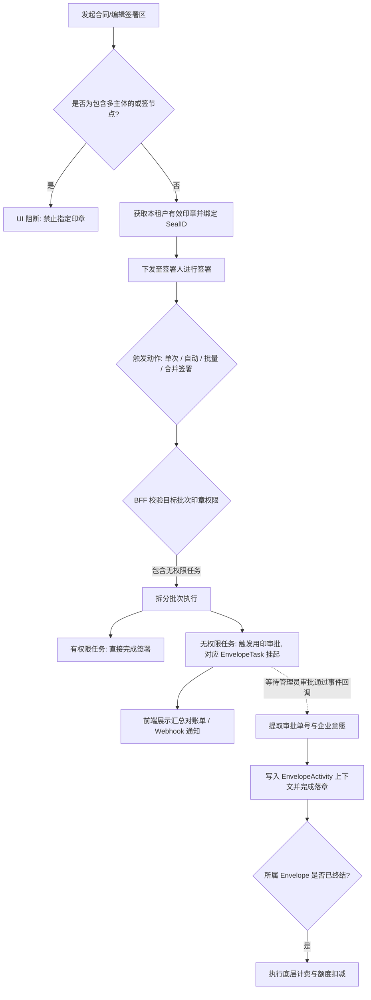

# 发起时可指定印章ID发起 

## 1. 修订历史与架构审计

| **日期** | **修改内容** | **责任人** | **架构审计结果 (L1-L4)** | **域模型映射** |
| --- | --- | --- | --- | --- |
| 2026-03-15 | 1. 定义印章资产过滤与签署区 SealID 强绑定逻辑。 2. 补充或签节点并发锁定与审批唤醒机制。 3. 确立跨企业参与者防腐边界与自动/批量签署审批触发。 4. 新增合并签署场景：确立跨主体混合批次的“尽力而为”策略、企业意愿代理及计费解耦逻辑。 5. 规范功能性需求表格输出格式。 | 三思 | **L1 通用底座级变更** (涉及 `status` 状态机挂起、多主体下 `EnvelopeActivity` 上下文双录、以及发起端校验规则扩展) | `envelope` `envelope_task` `envelope_participant` `envelope_activity` |

## 2. 文档概述

## 2.1 产品背景与目标

*   **核心定位**：基于 **PaaS 引擎（一底多端）**，进一步强化印章资产的租户级安全隔离与签署精确性。
    
*   **本次需求**：解决发起人在复杂组织架构下可能出现的“跨租户印章误用”风险，支持在签署区预设特定印章。深度适配**或签模式**、**自动/批量签署**以及\*\*合并签署（多主体）\*\*等高频复杂场景，在保障极简 C 端体验（一次认证，全部搞定）的同时，提升企业对核心印章资产的强管控与审批流转自动化率。
    

## 2.2 合规底线说明

*   **境内合规**：满足《电子签名法》要求，物理隔离确保印章所有权。合并签署中触发异步用印审批的任务，最终落章的电子证据链（意愿）将绑定为审批管理员/企业机构证书，确保合规闭环。
    
*   **数据安全**：严格遵循多租户数据隔离规范。严禁通过动态加签等操作将企业内部印章暴露给外部主体。
    

## 3. 需求范围与实现路径

## 功能清单

1.  **印章服务过滤**：RPC 接口根据 `tenant_id` 自动过滤“授权他人使用”的印章。
    
2.  **签署区属性扩展**：签署区元数据支持绑定特定 `seal_id`。
    
3.  **或签与防腐管控**：或签包含多主体时禁止指定印章；已指定印章节点强阻断添加外部企业参与者。
    
4.  **自动/批量/合并签署降级审批**：静默、批量或合并签署遇无权限时，采用“尽力而为”策略自动触发用印审批并挂起任务，不阻断全局流程。
    

## 实现路径方案

*   **L1 底座变更**：`EnvelopeTask` 状态机增强因审批触发的挂起与事件唤醒；`EnvelopeActivity` 支持在 `context` 中记录审批单号以实现企业代理意愿双录；发起端增加跨主体或签的校验拦截。
    
*   **L2 BFF 编排**：BFF 负责处理跨主体防腐拦截、批量/合并签署的拆单逻辑（分离成功与审批流），并在不区分入口上下文的情况下向底座发起审批请求。
    
*   **L3 前端扩展包**：签署插件适配“指定印章”展示态、或签锁定阻断提示、合并签署结果汇总反馈。
    

## 4. 功能逻辑

## 4.1 功能流程图 (Mermaid)

## 4.2 核心业务规则

*   **防腐边界与可见性规则 (L1/L2)**：印章仅展示 `OWNED` 且 `ENABLED` 状态。若签署区已绑定 `seal_id`，禁止通过任何途径（加签/转交）添加 `participantSubject` 非本企业的参与者。且多主体的或签节点发起时即禁止指定印章。
    
*   **合并签署混合批次处理规则 (L2)**：在合并签署场景下，不区分用户是“列表进入”还是“链接进入”。面对部分有权限、部分无权限的批次，BFF 采用尽力而为策略拆分执行：有权限的直接完成；无权限的按任务维度静默触发用印审批并挂起。
    
*   **审计双录与意愿代理规则 (L1)**：因合并签署挂起并由后续审批唤醒落章的任务，其底层 `EnvelopeActivity` 需在 `context` 记录经办人身份与触发审批的原始动作，但最终数字证书绑定企业实名，意愿证据链归属印章审批通过时的安全上下文。
    
*   **计费解耦规则 (L1)**：涉及指定印章挂起的任务，不进行前置扣费。合同份数的扣费严格挂载于整个 `Envelope` 状态机变更为“已完成”的瞬间执行，规避并发退费。
    

## 5. 权限控制与多端差异

## 5.1 权限策略 (PBAC 模型)

*   无新增权限
    

## 5.2 多端表现差异表

| **差异维度** | **国内站 (SaaS)** | **国际站 (SaaS)** | **本地化 (天印)** |
| --- | --- | --- | --- |
| **合规/认证要求** | 严格校验企业实名主体与印章归属，意愿代理需双录。 | 兼容多中心，主体校验逻辑需适配国际站数据模型。 | 暂不接入此功能 |
| **签署逻辑/流程** | 无权限时支持触发审批流（含批量/自动/合并签署场景）。 | 审批流集成情况视国际站底层组件而定。 | 暂不接入此功能 |
| **权限/展示差异** | 任务转交严格限制在本企业内部。 | **\[TBD\] 跨企业转交遇指定印章时的需要校验拦截非本租户不允许转交？** | 暂不接入此功能 |

## 6. 功能性需求 (面向用户)

添加图标

添加封面设置文档信息

刘海洋、

梁紫原等2人编辑

02-11 14:02 创建

5

| **功能名称** | **功能概述** |
| --- | --- |
| **发起签署设置签署方的指定印章** | 通过页面可指定签署方是否指定印章ID 限制条件： 仅发起方租户企业（不包含分子企业，无法指定分子企业印章，无法指定其他企业授权印章） 仅生效印章（停用的不可指定） 仅能指定企业章（经办人印章、法定代表人章无法指定） |

| **功能名称** | **功能概述** |
| --- | --- |
| **发起签署设置签署方的指定印章** | 通过页面可指定签署方是否指定印章ID 限制条件： 仅发起方租户企业（不包含分子企业，无法指定分子企业印章，无法指定其他企业授权印章） 仅生效印章（停用的不可指定） 仅能指定企业章（经办人印章、法定代表人章无法指定）  |
| **指定位置签署区指定印章ID** | 前期未指定，可在签署区单独指定，每个签署区可指定不同印章 备注：[https://forward-v3.timevale.cn/productManagement/list?id=15683](https://forward-v3.timevale.cn/productManagement/list?id=15683) 公有云最新需求需要支持指定跨企业印章，我们需要优先支持跨企业章应用才能支持这个功能。  |
| **指定印章ID时的交互** |  H5的也要做  |
| **自动签名失败** | 调用自动签署接口，若指定的印章已被删除，接口同步返回失败，且配置的 Webhook 收到 1 次重试后的最终失败通知 |
| **空资产拦截** | 若当前租户下未创建任何印章（或印章均已注销或停用），在签署区设置页面，点击“指定印章”功能无法选择印章并发起 |
| **实时状态拦截** | 合同发起时印章有效，但在签署人点击“提交签署”前的一秒，管理员在后台注销了该印章。系统应在提交瞬间返回校验失败，不允许完成数字签名。  |
| **单份/或签签署 - 权限引导与锁定** | 执行人无用印权限，弹窗提示并提供“提交用印审批”独立入口。在或签场景中，若某参与人正处于审批流程中，其他参与人的“提交签署”按钮置灰，并提示任务已被锁定。 |
| **合并签署/批量盖章 - 混合批次拆分** | 用户在待办列表勾选多个任务（可涵盖多主体）点击批量/合并盖章。系统完成核身并采取尽力而为策略：有权限的直接完成，无权限的自动转入用印审批流。结束后前端展示分类汇总对账单（如：“成功盖章 X 份，已自动为您提交用印审批 Y 份”）。系统后台按任务维度真实下发 Y 个独立审批单至印章中心。 |
| **自动签署 - 审批静默联动** | 业务系统通过 API 触发指定了印章的静默签署时，若目标参与者无该印章权限，接口不直接报错阻断流程，而是自动生成用印审批并挂起该 `EnvelopeTask` 等待回调。 |
| **用印审批回调与意愿代持** | 审批流在印章后台通过后，系统自动唤醒任务并完成落章。此动作不要求经办人重新登录做意愿认证，不产生前置计费动作，而是将管理员通过审批时的意愿上下文作为合法授权录入审计日志。 |

## 7. 验收标准 (AC)

| **场景** | **验收标准** |
| --- | --- |
| **发起端跨主体防腐** | 若设置了一个包含 A 企业和 B 企业的或签节点，此时点击该签署区，右侧面板无法指定具体印章。 |
| **跨企业加签防腐阻断** | 针对已指定印章的签署区，输入外部企业的手机号/邮箱尝试添加参与者时，系统强阻断并报错，无法完成人员添加。 |
| **合并签署无权限拆单汇总** | 通过无登录态（短链接）进入合并签署，批次包含 2 份有权限文件，1 份指定印章无权限文件。点击合并签署完成意愿后，前端准确弹窗提示“2份成功，1份触发审批”。底层精准生成 1 个挂起任务和 1 条后台审批流。 |
| **或签防并发独占锁定** | 或签节点中张三发起用印审批期间，李四进入签署页，看到“提交签署”置灰且有明确锁定提示；若李四尝试通过接口强刷提交，被系统明确报错拦截。 |
| **计费状态机解耦校验** | 执行上述合并签署时，无权限被挂起的任务触发期间，企业计费账户（如合同份数）余额不发生变动。待数日后审批通过且该信封流转至终态时，方才执行扣除 1 份合同额度。 |
| **意愿双录审计合规闭环** | 查阅由于“合并签署静默触发审批”并最终由“管理员审批完成落章”的合同审计日志，需明确记载发起操作人为实际经办人，但最终意愿数字证书归属为企业主体及审批安全上下文。 |