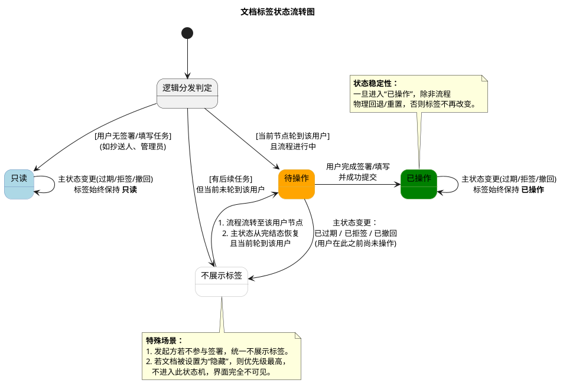
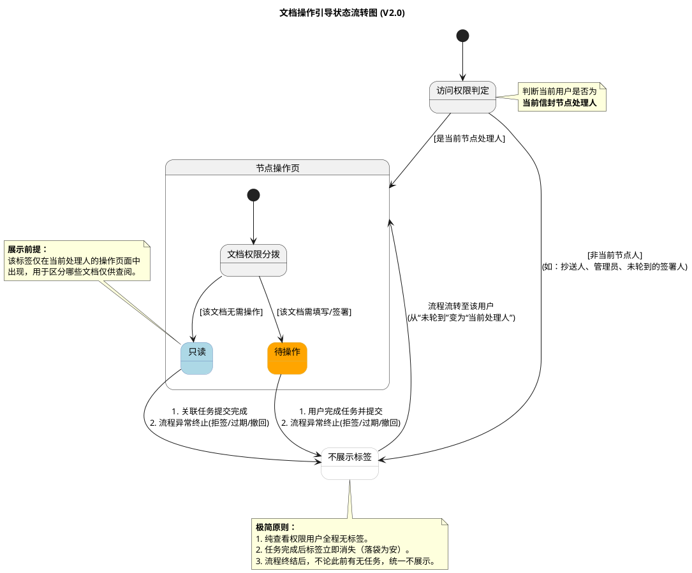
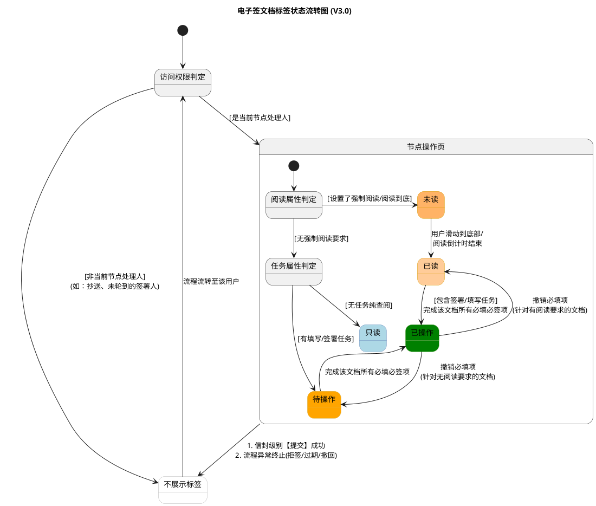

# 签署页文档标签梳理

## 1. 文档标签定义

标签用于提示当前用户对信封文档的操作状态。根据用户权限、流程进度展示以下四种状态：

| **标签名称** | **含义** | **适用场景** |
| --- | --- | --- |
| **待操作** | 需当前用户立即处理 | 流程处于当前节点，且用户尚未完成签署、填写或审批。 |
| **已操作** | 用户已完成处理 | 用户在当前或历史节点已操作过文档，且后续无其他操作。 |
| **只读** | 无操作权限，仅可查看 | **完全无签署/填写任务**的用户（如抄送人、管理员）。 |
| **不展示标签** | 暂无状态或不具备展示条件 | 见下方“不展示标签”专项说明。 |

### 💡 “不展示标签”专项说明

在以下场景中，系统将隐藏文档状态标签：

1.  **时机未到：** 用户在本文档后续有操作，但当前节点尚未流转到该用户（如顺序签第2顺位，当前为第1顺位）。
    
2.  **流程终结：** 主状态进入完结态（已过期、已拒签、已撤回），且用户在此之前**尚未操作**。
    
3.  **发起方特例：** 发起方如果不参与流程签署，统一不展示“只读”，改为不展示标签。
    

—

*   隐藏与前端展示无关，去除
    
*   已达到提交条件未改变文档状态，且已有引导提示，去除
    
*   其他标签跟国内站保持一致，作为辅助标签，如“已解约”、“已续签”
    

---

---

## 2. 状态转换规则

### (1) 主状态变化触发的转换

当信封主状态从“进行中”变为完结态，或从完结态恢复时：

*   **主状态 → 已过期 / 已拒签 / 已撤回：**
    
    *   **待操作** → 转为 **不展示标签**。
        
    *   **已操作** → **保留**“已操作”标签。
        
    *   **只读** → **保留**“只读”标签。
        
*   **主状态 → 恢复为“进行中”：**
    
    *   若用户曾因流程完结导致标签消失，且当前节点轮到该用户操作 → 恢复为 **待操作**。
        
    *   若用户此前已完成操作 → **保留**“已操作”。
        

### (2) 权限与顺序触发的转换

*   **顺序流转：**
    
    *   当流程流转至该用户节点 → 从 **不展示标签** 转为 **待操作**。
        
    *   当用户提交操作后 → 从 **待操作** 转为 **已操作**。
        
*   **或签流转：**
    
    *   当流程流转至该用户节点 → 从 **不展示标签** 全部转为 **待操作**。
        
    *   当其中用户提交操作后 → 从 **待操作** 转为 **已操作**。
        
    *   其余未签署用户 → 从 **待操作** 转为 **不展示**。
        
*   **只读持久性：**
    
    *   对于纯查看权限的用户，无论主状态如何变更，“只读”标签始终显示。
        

---

## 3. 特殊场景说明

### 隐藏逻辑（Hidden）

*   **定义：** “隐藏”是基于发起方设置或数据权限的底座逻辑，不作为前端状态机标签展示。
    
*   **优先级：** 只要文档处于“隐藏”状态，用户在界面上完全无法看到该文档，故不涉及任何标签展示。
    
*   **解除：** 当隐藏条件解除后，系统根据当前用户权限及流程进度，自动判定显示为“待操作”、“只读”或“不展示标签”。
    

---

## 4. 逻辑总结

1.  **身份决定底色：** 有任务的人在非操作期“不展示”，无任务的人（抄送/管理）始终显示“只读”。
    
2.  **过期即消失：** 只有已经落袋为安的“已操作”能在流程终结后保留，未完成的任务在流程终结后标签统一消失。
    
3.  **极简交互：** 去除了中间过程提示（如提交条件），仅保留核心权限状态。
    

---

公有云现状

|  | 待签 | 达到提交状态 | 待填 | 未读 | 已读 | 已签 | 已填 | 未签 | 只读 | 隐藏 | 已解约 |
| --- | --- | --- | --- | --- | --- | --- | --- | --- | --- | --- | --- |
| H5端签署页 | 单文件不展示 多文件展示 当前文档未达到提交状态展示 | 单文件不展示 多文件展示 | \- | \- | \- | 单文件不展示 多文件展示 当前文档已经签署完成 | \- | \- | 当前文档用户无需操作时展示 | 发起方指定当前文档参与方无法查看 | 发起解约流程并且已经完成 |
| APP端H5列表 | 签署任务未完成时展示 | \- | 填写任务未完成时展示 | \- | \- | 签署任务已完成时展示 | 填写任务已完成时展示 | 任务中断导致当前用户没有操作就结束 | \- | \- | \- |
| PC端签署页 | \- | \- | \-  | 设置强制阅读并未读时完成 | 设置强制阅读已读时完成 | 当前文档已经签署完成 | \- |  | 当前文档用户无需操作时展示 | 发起方指定当前文档参与方无法查看 | 发起解约流程并且已经完成 |
| PC列表 | 签署任务未完成时展示  | \- | 填写任务未完成时展示  | \- | \- | \- | \- |  | \- | \- | \- |

新方案核心差异点：

（1）合并了H5 和PC 不一致的情况

（2）合并了填写与签署不一致的情况

（3）将部分列表的状态也放到了文档中展示

---

## 📄 文档操作状态标签需求规格书 (V2.0)

### 1. 核心设计理念

从“全生命周期展示”转变为\*\*“操作导向提示”\*\*。

*   **减法原则**：非当前处理人、已处理完成、流程终结状态下，一律不展示标签。
    
*   **权限区分**：仅在当前处理人视角下，区分“需操作内容”与“仅需了解内容”。
    

---

### 2. 标签定义

系统仅保留两种前端展示标签：

| **标签名称** | **含义** | **适用场景** |
| --- | --- | --- |
| **待操作** | 需当前用户立即处理 | 流程处于当前节点，且该文档包含用户尚未完成的签署、填写或审批任务。 |
| **已操作**（0205新增） | 当前操作人在当前文件已达到提交条件 | 流程处于当前节点，且该文档所有需要当前用户必须操作的内容都已完成，达到提交填写/签署操作 |
| **只读** | 无操作权限，仅可查看 | 用户是当前节点处理人，但该特定文档仅需其查阅，无任何签署/填写任务。 |

不显示标签的情况：

1、单个文档

2、纯填写并且所有控件都是非必填控件

---

### 3. 标签展示矩阵（谁能看到？）

| **访问者身份** | **流程状态** | **文档权限** | **标签展示** |
| --- | --- | --- | --- |
| **当前节点处理人** | 进行中（轮到我） | 有签署/填写任务 | **待操作** |
| **当前节点处理人** | 进行中（轮到我） | 无任务，仅查看 | **只读** |
| **后续节点处理人** | 进行中（未轮到） | 任意 | 不展示 |
| **已处理完成的用户** | 进行中/已完成 | 任意 | 不展示 |
| **纯查阅方 (抄送/管理)** | 任意 | 仅查看 | 不展示 |
| **所有人** | 已过期/已拒签/已撤回 | 任意 | 不展示 |

---

### 4. 状态转换与消失规则

#### (1) 流转触发

*   **激活**：当流程流转至某用户节点时，该用户进入操作页，系统自动判定文档权限并显示“待操作”或“只读”。
    
*   **切换**：在或签（多人任一签署）场景下，当其中一人完成操作，其余候选人的标签同步变为“不展示”。
    

#### (2) 动作触发

*   **落袋为安**：当前用户点击“提交”或完成所有任务后，该信封内所有文档的“待操作”和“只读”标签**立即消失**。用户再次进入该信封时，界面保持纯净预览态。
    

#### (3) 异常终结触发

*   **即刻隐藏**：一旦信封主状态进入“已过期”、“已拒签”、“已撤回”，系统判定当前已无任何操作空间，所有用户视角下的“待操作”和“只读”标签**全部清除**。
    

---

### 5. 多端展示一致性说明

本方案统一 H5、App、PC 端的展示逻辑，消除原有的差异化表现：

*   **操作页与预览页**：标签逻辑完全一致，仅在用户具备“当前操作资格”时激活。
    
*   **列表页**：同步遵循上述逻辑，仅在“待办任务”分类下展示相应标签，已完成任务列表不显示文档级标签。
    

---

### 6. 特殊业务场景：混合权限处理

**业务定义**：允许同一个参与方在同一个信封中，既拥有“只读”文档，也拥有“待操作”文档。

*   **交互逻辑**：
    
    1.  用户打开信封，PC左侧/H5文档导航栏会清晰标注哪些是【待操作】，哪些是【只读】。
        
    2.  用户完成所有【待操作】文档后，变成【已操作】后，点击提交。
        
    3.  提交成功后，所有文档导航栏上的标签（包括原有的只读标签）全部移除。
        

---

## 📄 文档操作状态标签需求规格书 (V3.0)

## 1. 核心设计理念

本方案旨在将复杂的“文档全生命周期展示”重构为\*\*“以操作为导向的即时提示”\*\*，并完美兼容高合规要求的阅读控制机制。

*   **极简降噪**：非当前处理人、纯查阅方、已处理完成及流程终结状态下，一律不展示标签。标签仅服务于“当前正在进行”的任务。
    
*   **合规优先**：强制阅读要求具有最高优先级，视觉上优先覆盖常规操作标签。
    
*   **指引解耦**：标签系统仅客观反映文档所处的阶段状态，跨文档的操作引导交由全局“步骤条”负责，确保标签视觉纯粹。
    

---

## 2. 标签定义与适用场景

系统在当前操作人页面前端，动态展示以下五种状态标签：

| **标签名称** | **含义** | **适用场景** |
| --- | --- | --- |
| **未读** _(最高优)_ | 必须阅读且未完成 | 发起方针对该参与方设置了“强制阅读”或“阅读到底”，且用户尚未完成阅读。 |
| **已读** | 强制阅读要求已满足 | 用户已滑动到底部或阅读倒计时结束。此时不展示“待操作”，后续签署依赖外部步骤条引导。 |
| **待操作** | 需处理且未完成 | 该文档无强制阅读要求，且包含用户尚未完成的签署、填写或审批任务。 |
| **已操作** _(0205新增)_ | 当前文件已达到提交条件 | 该文档（无论是否有阅读要求）所有需要当前用户**必须操作**的内容均已完成。 |
| **只读** | 无操作权限，仅可查看 | 该文档无强制阅读要求，且仅需用户查阅，无任何签署/填写任务。 |

_💡_ _**“不展示标签”专项说明**__：当用户为非当前节点（如顺序签未轮到）、纯查阅角色（抄送/管理员）、或当前信封级别任务已全部提交、或主流程异常终结时，前端完全隐藏上述所有标签。_

---

## 3. 标签展示与覆盖矩阵（当前处理人视角）

| **文档配置权限** | **阅读完成情况** | **任务完成情况** | **最终展示标签** |
| --- | --- | --- | --- |
| **仅查阅 + 强制阅读** | 未读完 | \- | **未读** |
| **仅查阅 + 强制阅读** | 已读完 | \- | **已读** _(终态)_ |
| **仅查阅 (无阅读要求)** | \- | \- | **只读** _(终态)_ |
| **有任务 + 强制阅读** | 未读完 | 未签/未填 | **未读** |
| **有任务 + 强制阅读** | 已读完 | 未签/未填 | **已读** _(任务引导交由步骤条)_ |
| **有任务 (无阅读要求)** | \- | 未签/未填 | **待操作** |
| **有任务 (任意阅读要求)** | (已读完/无要求) | 已签/已填完 | **已操作** _(文件级终态)_ |

---

## 4. 状态转换与流转规则

#### (1) 流转激活与全局隐藏

*   **激活**：当流程流转至某用户节点时，该用户进入操作页，系统依据上述矩阵自动激活对应标签。或签场景下，任一候选人操作后，其余人员标签立刻转为“不展示”。
    
*   **全局隐藏（落袋为安）**：当用户完成当前信封内所有“已操作”与“已读/只读”文档，并点击信封级【提交】成功后，该用户视角下所有标签**立即消失**。
    
*   **异常终结隐藏**：信封主状态变为“已过期”、“已拒签”、“已撤回”时，当前已无操作空间，所有标签**立即清除**。
    

#### (2) 文档内状态递进与回退

*   **阅读递进**：【未读】 ➔ 滑动到底部/倒计时结束 ➔ 【已读】。
    
*   **操作递进**：在【已读】或【待操作】状态下，用户完成所有必填/必签项 ➔ 实时转为【已操作】。
    
*   **撤销回退**：若用户清除已签名的控件或清空必填项，导致不满足提交条件：
    
    *   原带有强制阅读要求的文档：【已操作】实时回退为【已读】。
        
    *   原无强制阅读要求的文档：【已操作】实时回退为【待操作】。
        

---

## 5. 状态流转图 (PlantUML)

代码段

